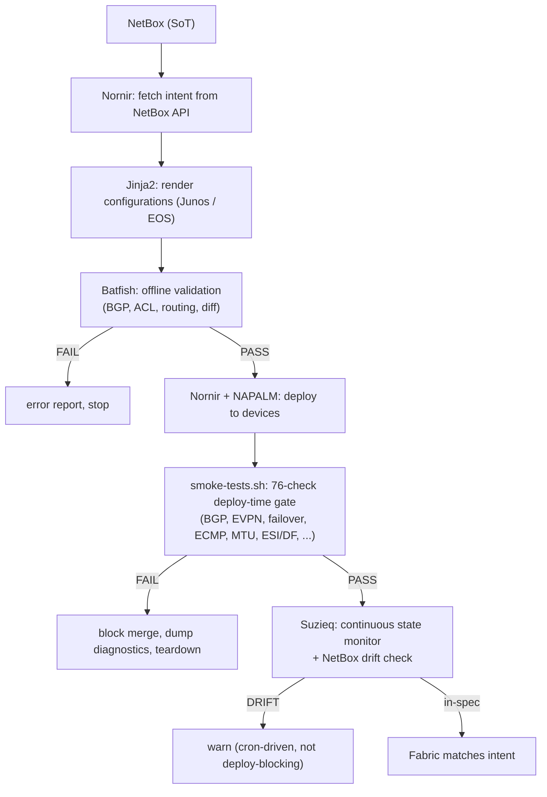
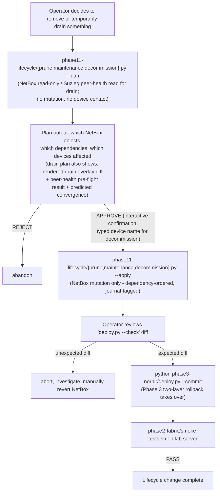

# EVPN-VXLAN DC Fabric - NetDevOps Lab

Building an automated EVPN-VXLAN data center fabric using containerlab, with NetBox as Source of Truth, a full CI/CD pipeline, configuration validation, security hardening, and multi-vendor DCI extension.

Goal: build a complete, repeatable workflow for managing DC network infrastructure using an Infrastructure as Code approach - from planning in NetBox to operational state validation.

---

## Phase 1 - NetBox as Source of Truth

A central source of truth for the entire infrastructure. Every piece of network information lives in NetBox - not in YAML files, not in someone's head, not in spreadsheets.

Scope:
- NetBox container in docker-compose (NetBox + PostgreSQL + Redis)
- Infrastructure modeling:
  - Sites: DC1 (DC2 added later in Phase 10)
  - Devices: 2x spine, 2x leaf (vJunos-switch), test hosts
  - Interfaces: physical spine-leaf links, loopbacks, IRB (prepared for future phases)
  - Connections: cables/links between devices (1:1 mapping with containerlab topology)
  - IP Addressing: management, loopback, P2P spine-leaf, host subnets
  - VLANs + VLAN Groups per site
  - Custom Fields: VNI per VLAN, L3VNI per VRF, ESI per LAG, anycast MAC per VRF
  - ASN modeled via native NetBox ASN objects (registry) + per-device underlay ASN in local_context_data
- NetBox population:
  - Python script (pynetbox) loading the initial state - no manual GUI clicking
  - Script is part of the repo, repeatable (idempotent)
- Documentation: design decisions (why this addressing scheme, why these ASNs, naming conventions)

Result: a complete network model in NetBox, ready for consumption by Nornir.

---

## Phase 2 - EVPN+VXLAN+ESI-LAG Fabric

Topology: 2x spine, 2x leaf on vJunos-switch in containerlab, 4x Linux hosts.

Scope:
- Containerlab topology file (`.clab.yml`) with device and link definitions - mapped to NetBox
- Juniper ERB (Edge-Routed Bridging) architecture:
  - Underlay eBGP in default routing instance (unique ASN per device)
  - Overlay iBGP with `family evpn signaling` in default instance (spines as route reflectors, AS 65000)
  - L2 overlay in `mac-vrf` routing instance with `service-type vlan-aware` (vlans, VNI-to-VLAN, vtep-source-interface)
  - L3 tenant routing in `vrf` instance (IRB anycast gateway, lo0.2, L3VNI, Type-5 routes)
  - OOB management in `mgmt_junos` instance (fxp0)
- VXLAN with VNI-to-VLAN mapping
- IRB anycast gateway on leaves (same IP + MAC on both leaves per VLAN)
- ESI-LAG (EVPN multihoming) between both leaves and test hosts (Linux containers)
  - ESI auto-derive from LACP PE system-id and admin-key
- EVPN core isolation: automatic ESI-LAG shutdown on overlay BGP loss
  - Explicit `network-isolation` profiles for faster failover (hard shutdown vs LACP timeout)
  - Hold-time tuning to prevent flapping during BGP reconvergence
- BGP operational features:
  - log-updown, graceful-restart, mtu-discovery
  - multipath multiple-as (underlay)
  - multihop no-nexthop-change, signaling loops 2 (overlay)
  - hold-time 30 (JVD timer, both UNDERLAY and OVERLAY groups)
  - graceful-restart dont-help-shared-fate-bfd-down
- BFD: multiplier 3, minimum-interval 1000 (single-hop underlay, multihop overlay)
- EVPN: duplicate-mac-detection, multicast-mode ingress-replication. Leave ARP suppression at the Junos default (ON) so leaves snoop host ARPs into the EVPN database and originate Type-2 (MAC+IP). `proxy-macip-advertisement` is intentionally NOT set: not supported on vJunos-switch (syntax error) and not needed in ERB anyway, where every leaf owns the IRB locally.
- Forwarding plane: chained-composite-next-hop ingress evpn, forwarding-table export LOAD-BALANCE policy with `load-balance per-packet` (mandatory for the PFE to install ECMP - without it BGP multipath shows multiple paths but only one next-hop is programmed)
- Chassis: aggregated-devices ethernet device-count
- IRB: `family inet mtu 9000`, `no-redirects`, virtual-gateway-address + virtual-gateway-v4-mac (anycast)
- LLDP on all interfaces (port-id-subtype interface-name)
- Jumbo MTU 9192 on fabric and host-facing interfaces (vJunos-switch caps at 9192, not 9216)
- Storm control profile on access ports
- Network-isolation profile on leaves with explicit core-isolation tracking
- 76-check smoke test suite (`smoke-tests.sh`) covering:
  - 3-stage pre-flight: BGP convergence, LLDP population, FIB programmed
  - Control plane: per-device BGP, EVPN routes, VTEP tunnels, LACP, BFD, LLDP, ESI, core-isolation
  - Data plane: L2 same-VLAN cross-leaf, L3 inter-VLAN, ESI-LAG, anycast gateway
  - Failover: ESI-LAG hard fail (docker pause), core isolation, spine failover, single-homed isolation
  - EVPN deep validation per leaf (mirrored): ECMP next-hop count in PFE, per-VNI Type-2/3, Type-5 in tenant VRF, jumbo MTU 8972 DF end-to-end, BFD diag, duplicate-MAC, EVPN database object asserts, BGP per-peer NLRI counters, interface error/drop counters
  - Cross-leaf invariants: ESI consistency, DF election agreement
  - Post-failure cleanup: VTEP withdrawal/reinstall after both ESI-LAG hard fail and core isolation
  - Poll-based waits (no hardcoded sleeps), JSON+jq parsers for fragile fields
  - Run time ~2 minutes on a converged fabric

Production-only features (NOT testable on vJunos-switch single-RE virtual platform - documented for completeness, deferred to real hardware):
- `nonstop-routing` and `layer2-control nonstop-bridging` (require dual RE)
- `forwarding-options vxlan-routing` hierarchy (the whole hierarchy is absent from the vJunos parser - verified 2026-04-11 on dc1-leaf1 vJunos 23.2R1.14 via `configure private; set forwarding-options vxlan-routing; commit check` -> `syntax error` pointing at `vxlan-routing`. Blocks `overlay-ecmp`, `next-hop` table sizing, and `shared-tunnels` scale tuning on this platform.)
- BFD sub-second timers (vJunos PFE-less BFD won't run faster than 1000ms)

Note on `chassis network-services enhanced-ip`: previously listed here as "QFX-only / not in vJunos". Verified live 2026-04-11 that vJunos 23.2R1.14 accepts the knob at parse level (`commit check` succeeds), so the parser-level limitation claim was wrong. Runtime effect on the simulated PFE was not tested because nothing in the lab needs the feature; if a future phase requires it, verify properly there.

Validated against two production EVPN-VXLAN fabrics. Earlier revisions of this lab carried `no-arp-suppression` per VLAN and a static-ARP workaround on hosts because vJunos-switch IRBs were assumed to not generate ARP replies. That assumption was wrong - the bug was `no-arp-suppression` itself, which disabled the EVPN ARP-snoop-and-reply mechanism. With ARP suppression at its Junos default (ON), leaves snoop local host ARPs into the EVPN database, originate Type-2 (MAC+IP) routes, and reply locally to gateway ARPs. Hosts learn the anycast gateway MAC dynamically without any host-side workaround.

Result: a fully operational fabric with L2 VXLAN bridging, L3 inter-VLAN routing (anycast gateway, dynamic ARP), ESI-LAG multihoming, per-packet ECMP across both spines, and a 76-check smoke test suite covering control plane, data plane, failover, EVPN deep validation, and post-failure cleanup.

---

## Phase 3 - Nornir IaC Framework

Replacing manual device configuration with an Infrastructure as Code framework - Nornir pulls data from NetBox, renders configurations, and deploys them.

Scope:
- Nornir with `nornir-netbox` plugin as inventory (hosts, groups, per-device data from NetBox API)
- Additional data from NetBox: VLANs, VNIs, ASNs, interfaces, addressing - fetched via pynetbox in tasks
- Jinja2 templates generating Junos configuration from NetBox data
- Nornir with NAPALM driver (junos) for configuration deployment
- `deploy.py` script as entry point: fetch from NetBox -> render -> deploy -> report
- Idempotency: re-running causes no changes if the NetBox intent hasn't changed

Result: `python deploy.py` builds the full fabric from zero to production. Change in NetBox -> re-deploy -> fabric updates. Phase 3 is **add/update-oriented**: it covers the full path from yaml -> NetBox -> Nornir render -> NAPALM commit-confirmed deploy for adding new objects and updating the small allowlist of fields populate.py knows how to patch. Destructive and operator-driven lifecycle operations (prune of allowlisted classes, graceful drain for safe firmware upgrades, whole-device or whole-link decommission) are introduced separately in Phase 11 - Controlled Lifecycle Operations.

---

## Phase 4 - Batfish Pre-Deployment Validation

Offline structural validation of rendered configs before they touch any device. Catches the class of bugs (BGP topology errors, undefined policy references, parse failures, IP ownership conflicts, loopback unreachability) that the Phase 3 regression gate and on-disk guard don't cover - and catches them **without** spinning up the lab.

Scope intentionally narrowed from "everything Batfish can do" to "what Batfish models reliably on Junos". The two boundaries below are deliberate, not gaps:

- **Runtime EVPN behaviors** (Type-2/3/5 propagation, ESI-LAG, DF election, BFD convergence) are owned by the Phase 2 smoke suite, which validates them on the live fabric. Batfish's Junos EVPN modeling is partial - tracked upstream in [batfish#5036](https://github.com/batfish/batfish/issues/5036) (Juniper VXLAN support, still open); duplicating Phase 2 here would add false positives without signal.
- **ACL/firewall analysis** (`testFilters` / `searchFilters` for BGP/VXLAN UDP 4789/BFD reachability) is deferred to Phase 8 (CIS/PCI-DSS hardening). The current rendered configs have zero filters, so there's nothing to analyze; the analysis becomes load-bearing once management ACLs land.
- **Route-target consistency** is already enforced by the Phase 3 byte-exact regression gate against `phase3-nornir/expected/`. Re-checking it in Batfish would duplicate without adding signal.

Scope:
- Batfish container in docker-compose, deployed alongside the Phase 1 NetBox stack on the netdevops services VM. Image pinned by SHA256 digest for reproducibility.
- Python validation script (`phase4-batfish/validate.py`) using pybatfish, runs after config rendering, before deployment. Wired into Phase 3 `deploy.py` via opt-in `--validate` flag and as a standalone CI stage.
- Reachability probe (TCP/9996) before any pybatfish API call so unreachable Batfish fails fast with an actionable error.
- Seven structural checks against the rendered snapshot:
  1. `init_issues` - vendor-model conversion errors, parser red flags (with documented Junos mac-vrf VLAN false-positive filter)
  2. `parse_status` - file-level parse failures
  3. `bgp_sessions` - every defined BGP session reaches ESTABLISHED in simulation (catches ASN mismatch, missing peer, unreachable peer, wrong family)
  4. `bgp_edges_symmetric` - one-sided peer definitions (asymmetric template bug)
  5. `undefined_references` - template emits a policy/community/AS-path name that isn't defined (with documented Junos mac-vrf VLAN false-positive filter)
  6. `overlay_loopback_reachability` - every iBGP overlay peer's loopback is in the local BGP RIB
  7. `ip_ownership_conflicts` - no non-anycast IP is owned by more than one (node, VRF) pair (catches duplicate /31 P2P numbering, loopback collision, IRB unicast collision)
- **Differential analysis** (the killer Batfish-for-CI feature): when `--reference-snapshot` is provided (typically `phase3-nornir/expected/`), validate.py initializes both snapshots and reports what changed - device set delta + BGP topology delta. Informational output, never affects exit code. Phase 6's PR-comment bot consumes the JSON `diffs` field.
- Two-tier pytest suite: unit tests (mocked pybatfish, ~1s, runs on every PR) + integration tests (against real Batfish container, marked `@pytest.mark.integration`).
- CI-friendly JSON output (`--format json`) with stable schema for the Phase 6 PR-comment bot.

Result: structural configuration errors caught before touching any device. Runtime correctness stays Phase 2's job; ACL hygiene is deferred to Phase 8.

---

## Phase 5 - Suzieq Operational State Monitoring + NetBox Drift Detection

**Status: DONE (2026-04-11).** Parts A + B-min + B-full + C + D all shipped, plus two post-review correction rounds. See `phase5-suzieq/README.md` for the full deployment guide + contracts + gotchas. The scope below is the original planning text from before the phase shipped; read it for intent, read the README for what actually landed.

Implementation summary:
- **Part A** — 3-container SuzieQ stack (poller + coalescer + rest) + build-time image patcher adding a project-owned `junos-vjunos-switch` devtype + `gen-inventory.py` reading NetBox for deploy-time inventory generation
- **Part B-min / B-full** — 8-dimensional NetBox-vs-state drift harness in a sibling `drift` container: device presence, interface admin, LLDP topology, BGP session, EVPN VNI, loopback reachability, anycast MAC, peer-leaf IRB ARP
- **Part C** — 4 state-only invariant assertions + 5-minute systemd timer (no NetBox credentials needed on the assertion loop)
- **Part D** — time-window queries over the parquet history (`bgp_flaps`, `route_churn`, `mac_mobility`) + hourly systemd timer producing `/var/log/suzieq-drift/timeseries-latest.json`
- **Rev 2 (architectural review corrections)** — `Drift.category` axis (6-value allowlist: inventory/topology/control_plane/overlay/arp_nd/meta), central `TABLE_REGISTRY` in `drift/state.py`, envelope self-check with `status` + `warnings[]` fields via sqPoller heartbeat
- **Phase 5.1 (operational hardening)** — `SUZIEQ_STRICT_HOST_KEYS` env var, pytest-cov baseline 91.9%, `--exit-nonzero-on-degraded` opt-in flag on `--mode timeseries`, live schema guards catching new engine-computed columns, real HTTP healthcheck on `sq-rest-server` (replaces a `/dev/tcp` probe that let a 3-day accept-but-no-serve wedge go undetected), REST vs raw pyarrow schema-drift smoke test. 362 default tests + 12 live tests + 2 standalone live scripts.

Phase 6 now has everything it needs to build a CI/alerting consumer: the `status` / `warnings[]` envelope fields, the `category` axis on drift records, the `--exit-nonzero-on-degraded` hook for systemd `OnFailure=`, and the engine-computed-column regression guards. Phase 5 is architecturally closed; no more logic belongs in the drift harness.

---

Re-scope rationale (original planning text): the Phase 2 smoke test suite already covers the originally-planned assertions (BGP Established + per-peer EVPN NLRI, per-VNI Type-2/3, Type-5, TENANT-1 /32 object asserts, ESI-LAG with cross-leaf DF election consistency, LLDP neighbor counts, VXLAN tunnel state, MAC/IP entries against an expected host list). Re-implementing those in Suzieq would be duplication. Phase 5 instead focuses on what the smoke suite cannot do: continuous time-series state, vendor-neutral schema (needed for Phase 10 multi-vendor), and intent-vs-state diff against NetBox.

Smoke tests = deploy-time gate (one-shot, runs in CI after `containerlab deploy`).
Suzieq = runtime monitor (cron, dashboards, alerts).

Scope:
- Suzieq collector container in docker-compose, polling all DC1 devices via SSH every 60s, persisting to its Parquet store
- **NetBox-versus-Suzieq diff layer** - the central capability of this phase:
  - Pull intent from NetBox API (devices, interfaces, BGP sessions, VLANs, VNIs, expected LLDP topology)
  - Pull state from Suzieq tables (`bgp`, `lldp`, `interfaces`, `evpnVni`, `routes`, `macs`)
  - Diff and report drift: missing BGP session, LLDP neighbor change vs NetBox cabling, VLAN-to-VNI mismatch, unexpected loopback advertised, etc.
  - This is "validation against intent" - the part that has zero overlap with the smoke suite
- **Time-series assertions** (things the smoke suite cannot answer because it is point-in-time):
  - BGP session flap count > 0 in last N minutes
  - LLDP neighbor change since baseline
  - EVPN Type-2/3/5 route count delta over time (sudden drops = silent withdraw)
  - VXLAN VTEP appear/disappear events
  - Interface error/drop counter rate (not just absolute value)
  - MAC mobility events (mac moved between VTEPs)
- **Strict assertions mirroring the smoke suite depth** (run by Suzieq on every poll, not just at deploy):
  - All BGP sessions Established AND each session has received-prefix-count > 0 per peer per AFI/SAFI
  - Per-VNI Type-2 / Type-3 route presence (not aggregate count)
  - ESI consistency: same ESI string seen on both leaves of a multi-homed group, identical DF election outcome
  - VTEP count per leaf == expected (from NetBox topology)
  - Specific tenant host /32s present in TENANT-1.inet.0 via EVPN
  - BFD session diag == None on every session
  - LLDP neighbor table matches NetBox cabling exactly (name + interface, not just count)
- Pass/fail report per assertion + structured output for the Phase 6 CI pipeline
- Optional: Suzieq REST API exposed for ad-hoc queries from operators

Result: automated drift detection between NetBox intent and live fabric state, plus a queryable time-series record of fabric behavior. Smoke and Suzieq are complementary: smoke says "this deploy landed cleanly," Suzieq says "is the fabric still in spec right now and how did it get there."

---

## Phase 6 - GitHub Actions CI/CD Pipeline + Test Framework Build-out

Connecting all components into an automated pipeline triggered on every PUSH/PR, and extending the Phase 3 unit test foundation into a full integration test suite.

### Test framework scope (extends Phase 3 unit tests)

Phase 3 landed `phase3-nornir/tests/` (60 pure-function unit tests, ~2 sec, no external dependencies). Phase 6 extends this with the integration tests that need either mocked external systems or a running lab:

- **Full template rendering tests**: golden-file tests that render `main.j2` against a complete fixture `host.data` for each device role (spine, leaf) and assert byte-equality with checked-in expected output. Catches template regressions without needing NetBox or devices.
- **`enrich_from_netbox()` integration tests**: use `vcrpy` (or `pytest-recording`) to record one real pynetbox session against a known-good NetBox snapshot, then replay it in CI. Catches NetBox schema/model drift and pynetbox query bugs without needing a running NetBox in CI.
- **NAPALM task tests**: mock the NAPALM Junos driver (`napalm.base.test.double.MockDevice` or pure `unittest.mock`) so `napalm_deploy`, `napalm_get`, `liveness_check`, and the marker-based rollback (`restore_from_marker`) can be exercised without devices. Pin: `napalm_deploy` never sets `revert_in`; `commit_message` propagates as the Junos commit log; `restore_from_marker` walks history by log text and rolls back to (marker-index + 1).
- **`pytest-nornir` runner**: wire Nornir runs as pytest fixtures so each device becomes a parametrized test case in CI output (per-device PASS/FAIL row in the GitHub Actions summary).
- **Coverage reporting**: `pytest --cov=phase3-nornir --cov-report=html --cov-fail-under=80` as a CI gate. The Phase 3 unit tests are at ~roughly that level for the safety-critical surfaces; the integration tests bring it up across the whole module.

### CI/CD pipeline scope

- Workflow `.github/workflows/fabric-ci.yml`
- Pipeline stages:
  1. **Lint** - yamllint, ruff on Python, Jinja2 template validation
  2. **Unit tests** - `pytest phase3-nornir/tests/` (the 60 pure-function tests from Phase 3 + the Phase 6 mocked-integration ones). Hard fail = block merge.
  3. **Render** - Nornir fetches intent from NetBox -> generates configurations
  4. **Regression diff** - `deploy.py --check` against `phase3-nornir/expected/`. Hard fail = block merge.
  5. **On-disk deploy guard** - `assert_safe_to_deploy()` on every rendered config. Hard fail = block merge.
  6. **Batfish Validate** - offline analysis of generated configs + differential analysis
  7. **Batfish Results -> PR Comment** - bot posts to PR what will change (new BGP sessions, modified ACLs, affected prefixes)
  8. **Deploy** - containerlab up + Nornir `--commit` (optional, `workflow_dispatch` on **self-hosted runner ON the lab server**; the smoke suite reaches into Docker network namespaces via `nsenter`, so it must run on the host where containerlab/Docker live, not a remote CI worker)
  9. **Smoke gate** - run `phase2-fabric/smoke-tests.sh` from the same self-hosted runner (~2 min). Hard fail = block merge.
  10. **Marker-based rollback on failure** - if smoke or drift fails, the workflow runs `deploy.py --rollback-marker $COMMIT_MARKER` which walks each device's commit history, finds the entry whose log == marker, and rolls back to the configuration immediately before that commit. Replaces the older commit-confirmed approach because the smoke suite's failover commits would clear `revert_in` mid-run.
  11. **Suzieq drift check** - NetBox-vs-state diff (Phase 5 Python harness). Soft fail = warn.
  12. **Teardown** - containerlab destroy (only if the workflow stood it up; do not destroy a long-running dev lab)
- Stages 8-12 live in a separate `fabric-deploy.yml` workflow (spinning up the lab in CI is resource-intensive; PRs run lint/unit/render/diff/guard/Batfish only)
- Pipeline status badge in README

### Secret material in CI

Phase 3 reads `JUNOS_LOGIN_PASSWORD`, `JUNOS_LOGIN_SALT`, `JUNOS_SSH_USER`, `JUNOS_SSH_PASSWORD`, `NETBOX_TOKEN` from a shell env file outside the repo. CI must inject the same env vars from GitHub Actions encrypted secrets (or, for production, a vault-backed entry script - see `phase3-nornir/README.md` "Secrets and credential material" section for the vault wrapper pattern). Never commit secrets to the repo, never pass them as workflow inputs.

Result: every change to NetBox/templates/code is automatically validated through unit -> render -> diff -> guard -> Batfish -> (optional) deploy + smoke. PRs include an impact analysis report. Failed deploys self-correct via marker-based rollback (CI walks each device's commit history by the unique deploy marker and reverts). The Phase 3 test foundation extends into a full integration suite mocked against vcrpy/double drivers so CI runs in seconds without external dependencies.

---

## Phase 7 - Forwarding Scale + Convergence Tuning

Most originally-scoped Phase 7 items landed in Phase 2 during the JVD best-practice review:
- Per-packet ECMP via forwarding-table export LOAD-BALANCE - DONE in Phase 2 (was a critical bug fix; the PFE was installing only one next-hop until the policy was added)
- Anycast gateway, IRB interfaces, Type-5 routing - DONE in Phase 2
- ESI-LAG failover, leaf failure traffic takeover - DONE in Phase 2 (smoke tests Section 4)
- proxy-macip-advertisement - DROPPED. Not supported on vJunos-switch and not needed in ERB anyway (CRB construct for L2-only leaves)

Remaining scope - things that genuinely need a dedicated phase:
- VXLAN routing scale tuning: `interface-num`, `next-hop` table sizing, `shared-tunnels` (production-class scale, not relevant in a 4-device lab but worth modeling)
- Richer BGP export policy: per-subnet direct route advertisement instead of loopback-only export, with explicit allow/deny terms
- ECMP fast-reroute (BGP PIC + FRR) for sub-second failover under specific failure modes
- BGP add-path / multipath multiple-as tuning across spine RR boundary
- BFD micro-BFD on aggregated interfaces (would need physical hardware to validate)
- Selective route leaking between tenant VRFs (preview of multi-tenant work)

Most of these need real hardware to actually validate. May be re-scoped or merged into Phase 10 (multi-DC) where scale starts to matter.

Result: forwarding-plane scale knobs documented and where possible exercised; remaining items deferred to hardware lab.

---

## Phase 8 - CIS / PCI-DSS Hardening

Securing the fabric according to CIS Junos benchmarks and PCI-DSS v4.0 requirements.

Scope:
- Extended NetBox data with hardening parameters (config context or custom fields):
  - NTP servers + authentication keys
  - Syslog servers
  - RADIUS/TACACS+ servers + shared secrets
  - Allowed management subnets
  - Password policy
- New Jinja2 templates per hardening area:
  - Management ACL (restrict SSH/NETCONF access to management subnet)
  - NTP with authentication (MD5/SHA)
  - Syslog to external server (TCP + TLS if supported)
  - RADIUS/TACACS+ as authentication source
  - Disable unused services (finger, telnet, SNMP v1/v2c)
  - Enforce TLS 1.2+ on NETCONF/HTTPS
  - Login banner
  - Configuration change logging
- Extended Batfish validation for hardening controls (management ACL, protocol filtering)
- Helper container with NTP/syslog/RADIUS/TACACS+ - docker-compose, outside the main lab scope, deployed manually or via script
- Documentation: mapping of CIS/PCI-DSS controls -> Junos configuration -> NetBox data

Result: hardened fabric with documented security controls, hardening parameters managed from NetBox.

---

## Phase 9 - gNMI Monitoring

Streaming telemetry from devices to a monitoring stack.

Scope:
- gNMI configuration on vJunos (OpenConfig / Juniper-native YANG paths)
- Telegraf as gNMI collector (container in docker-compose)
- Subscriptions:
  - Interfaces: counters, errors, status
  - BGP: session state, prefixes received/sent
  - System: CPU, RAM, temperature (if available on vJunos)
  - EVPN: route count per instance
- Export to Prometheus (Prometheus outside lab scope, but endpoint exposed)
- Extended Nornir to deploy gNMI configuration to devices
- Sample Grafana dashboard as JSON (optional)

Result: devices streaming telemetry, ready for consumption by Prometheus/Grafana.

---

## Phase 10 - Second DC (Arista cEOS) + DCI

Extending with a second datacenter on a different vendor and inter-DC connectivity.

Scope:
- Extended NetBox: new site DC2, new devices (2x spine, 2x leaf cEOS), new interfaces, links, addressing, VLANs/VNIs per site
- DC2: 2x spine, 2x leaf on cEOS (Arista) in the same containerlab file
- Multi-vendor Nornir: per-vendor groups in NetBox, separate Jinja2 templates (Junos vs EOS), shared deployment logic
- EVPN Type-5 DCI between DC1 (Junos) and DC2 (EOS):
  - Option A: eBGP EVPN directly between border leaves
  - Option B: VXLAN-to-VXLAN with gateway on border leaves
- Extended Batfish with EOS configurations (Batfish supports both NOSes natively)
- Extended Suzieq with cross-DC assertions (EVPN routes from DC1 visible in DC2 and vice versa)
- Tests: L2 stretched traffic between DCs, L3 inter-DC traffic, border leaf failover
- DC2 hardening - same controls from Phase 8, different templates (EOS)

### Scale-driven refactors (deferred from Phase 3 to here, where they actually matter)

Phase 3's `enrich_from_netbox()` makes ~50 separate `pynetbox` REST calls per host. Fine for 4 devices (~2-3 sec/host), painful at 8+ devices and unsustainable at 40+. Phase 10 doubles the device count with DC2 and is the natural point to refactor:

- **Switch enrich data fetching from per-object pynetbox REST to a single GraphQL query per host** (Nautobot Golden Config does this; NetBox 4.x has a GraphQL API). One round-trip per device instead of N+M. Drops enrich time by ~10x and makes per-VLAN/per-prefix iterations cheap.
- **Per-vendor enrich helpers**: `tasks/enrich_junos.py` and `tasks/enrich_eos.py` for vendor-specific data shaping (e.g. ESI auto-derive vs ESI explicit, VXLAN VNI binding syntax differences). Shared `tasks/enrich_common.py` for platform-neutral data.
- **Per-vendor template trees**: `templates/junos/` (already exists) + `templates/eos/`. The `STANZAS` table and rendering loop become role+vendor parametrized.
- **Per-vendor expected/ baselines**: `phase3-nornir/expected/junos/` + `phase3-nornir/expected/eos/`.

Result: multi-vendor, multi-DC EVPN-VXLAN with NetBox as single source of truth, full CI/CD pipeline, end-to-end validation, and an enrich path that scales to dozens of devices without becoming a per-host bottleneck.

---

## Phase 11 - Controlled Lifecycle Operations

Closing the operational gap between Phase 3 ("from zero to production") and a real day-2 lifecycle. Phase 3 demonstrated NetBox-as-SoT for **adding** infrastructure; Phase 11 adds **explicitly limited, safe** patterns for **modifying**, **temporarily draining**, and **removing** it.

### Why this is deliberately limited

A full desired-state reconciler (yaml + computed CREATE/UPDATE/DELETE plan against every object class in NetBox, with full dependency ordering, opt-in destructive flags, journal integration, rollback, etc.) is a real engineering investment. Production network orchestrators do this; for a showcase lab it would be a 10x scope explosion that brings 10x the test surface, edge cases, and rollback complexity.

Phase 11 takes a different bet: **four explicit tiers of action, narrow allowlists, and never any blind cleanup.** The lab demonstrates safe day-2 operations without pretending to be a full reconciler. The honest framing (controlled, limited, predictable) is better showcase material than the dishonest framing (looks like full CRUD but breaks under edge cases).

### Four tiers of operation

#### Tier 1: Add / update (non-destructive)

The Phase 3 `populate.py` path, **explicitly named** as the non-destructive mode. No new entry point - `python populate.py` continues to work as today - but the README and the script's banner make it explicit that this mode never deletes anything and only updates the small set of fields where Phase 1 + Phase 3 already added per-field patches (site custom_fields, VLAN names, lo0 IP VRF assignment).

If you need to update a field outside that allowlist, you have two documented paths:
- Edit in NetBox UI (faster, auditable via NetBox journal)
- Add the field to the populate.py update allowlist via PR (slower, version-controlled, applies on every run)

This tier is explicit and bounded. No surprises.

#### Tier 2: Prune selected

A new entry point: `python phase11-lifecycle/prune.py <class>`. Removes objects from a **small enumerated allowlist of managed object classes** that the project explicitly owns. Anything outside the allowlist is rejected with a clear "not supported" error.

| Allowlisted class | Why safe to prune | Example use case |
|---|---|---|
| Host-facing access port `untagged_vlan` | Reverses Phase 3 prep step 14b | Unbind a VLAN from a port without removing the interface |
| LAG member binding (`interface.lag` field) | Reverses Phase 3 prep step 14a | Re-home a port from one ae to another |
| IRB unit (`irb.<vid>` virtual interface) | Reverses Phase 3 prep step 14c | Retire a VLAN's L3 gateway |
| BGP neighbor (when modeled as NetBox object) | Reverses Phase 3 enrich derivation | Drop a stale peer from a fabric link |
| L2VPN VLAN termination | Reverses Phase 3 prep step 14e | Remove a VLAN from a tenant's MAC-VRF |

Anything NOT in this list - devices, cables, prefixes, VRFs, sites, custom fields, anycast gateway IPs, lo0 interfaces - is **explicitly out of scope for prune** and requires Tier 4 or manual NetBox UI action.

How prune works:
- **Diff-driven**: takes a yaml stanza (or explicit object IDs) and computes "objects in NetBox of this class that are not in yaml"
- **`--plan` mandatory by default**: prints the objects it would remove, prints the dependent objects that would be affected, and exits
- **`--apply` requires interactive confirmation OR `--yes`**
- **Each prune action writes a NetBox journal entry** for audit
- **Hard-fail if any to-be-pruned object has a dependency the prune doesn't know about** (e.g. an IRB still has IPs assigned, or an L2VPN termination is the last termination on a non-empty L2VPN)
- **Never combined with a device push in one step**: prune mutates NetBox only. The operator runs `python phase3-nornir/deploy.py --commit` separately as the explicit second step. The two-step model means you always have a chance to review the rendered config diff after the NetBox change before anything reaches a device.

#### Tier 3: Maintenance mode (graceful traffic drain)

A separate path for **temporarily** removing a device from the data path so a human operator can do disruptive work on it (firmware upgrade, line-card swap, RMA, BIOS update, kernel patch) without dropping production traffic. Reversible by definition - the device stays in NetBox, the cables stay in NetBox, the BGP sessions stay configured. The drain only changes how peers select paths, not what exists.

Why this is its own tier and not part of decommission: maintenance is the **most common** day-2 destructive-looking operation in real networks (every device gets firmware upgrades; very few get decommissioned), and conflating it with permanent removal is exactly how operators end up either (a) dropping traffic during a "routine" upgrade because they skipped the drain or (b) accidentally removing a device they meant to bring back. Naming the workflow separately makes the intent unambiguous.

New script: `phase11-lifecycle/maintenance.py <device> {drain|restore} [--plan|--apply]`. Steps for `drain`:

1. **Pre-flight check**: verify the redundant peer is healthy. The drain is unsafe if the peer is itself down or already draining. Reuses Phase 5 SuzieQ assertions:
   - For a spine: the OTHER spine has all expected BGP sessions Established and is forwarding traffic.
   - For a leaf in an ESI-LAG pair: the OTHER leaf in the same ESI is healthy AND is currently the DF or capable of becoming DF for every ESI it shares.
   - Hard fail if the peer is not in a state that can absorb the load.
2. **Apply drain knobs** (BGP-level traffic steering, not interface shut):
   - **Underlay**: AS-path prepending on every eBGP session out of the device (3x prepend by default, configurable). Peers prefer the alternate path; the device still has full reachability so SSH and Suzieq polling continue to work.
   - **Overlay (EVPN)**: announce all locally-originated EVPN routes with the **graceful shutdown community** (RFC 8326, `well-known:graceful-shutdown` = 65535:0). Remote VTEPs lower local-preference on those routes and converge on the peer VTEP.
   - **ESI-LAG (leaf only)**: trigger DF re-election by withdrawing the local Type-4 ES route (or, on platforms that support it, set the ESI-LAG DF preference to lowest so the peer becomes DF). Host-facing LACP stays UP so the device can still talk to its hosts after restore - this is a routing-level drain, not a link-level shutdown.
3. **Wait for convergence**: poll Suzieq until the BGP best-path on every neighbor has shifted off the draining device, then poll for N additional seconds (default 30) to let host-side ARP/MAC tables age out and re-learn via the peer.
4. **Verify drain**: traffic counters on the drained device's transit interfaces decrease to zero (or a configured threshold) and stay there. The device is still UP and reachable, but no production traffic flows through it.
5. **Hand off to operator**: print a clear "device is drained, safe to take maintenance action" message with the BGP / EVPN / ESI state at drain time captured in a JSON artifact under `phase11-lifecycle/maintenance-state/<device>-<timestamp>.json`. The operator now does whatever they need to do (firmware upgrade via vendor tooling, hardware swap, etc.) outside this script.

Steps for `restore`:

1. **Pre-flight check**: the device is reachable (SSH, BGP TCP up) and its software version / hardware inventory matches what the operator declares with `--expect-version` (catches "I drained spine1 then forgot which spine I was upgrading" class).
2. **Reverse the drain knobs** in opposite order: ESI-LAG DF preference back to default, EVPN graceful shutdown community removed, eBGP AS-path prepend removed.
3. **Wait for convergence + re-verify**: BGP back to Established with full prefix counts, traffic counters back to expected baseline, ESI DF election balanced.
4. **Re-run smoke gate**: full Phase 2 smoke from the lab server. Hard fail on any regression.
5. **Snapshot post-restore state**: the same JSON artifact format as drain, for diff-against-pre-drain comparison.

How `maintenance.py` is bounded:

- **Pure config-overlay drain, never an interface shut**: an interface shut on the wrong port can take down a host LACP bundle in a way that hard-loses traffic during the drain itself. The BGP / EVPN / DF approach reroutes BEFORE removing the device from the path.
- **Single device per invocation**: the script refuses to drain two devices at once. Operators who want to drain a whole pair (e.g. both spines for a fabric-wide upgrade) run the script twice with explicit confirmation between runs.
- **Reversible by design**: drain mutates only the rendered config push (a small overlay applied via Phase 3's deploy flow), not NetBox. The drain push uses the same `--liveness-gate` inner safety net Phase 3 uses (commit confirmed 120s + liveness + napalm_confirm_commit), so a botched drain that breaks SSH self-recovers via Junos auto-rollback. If the drain commits successfully but downstream verification (smoke, BGP convergence checks) fails, the same `--rollback-marker` outer gate reverts via commit-history walk.
- **No NetBox mutation**: maintenance is a runtime state, not an intent change. The device remains a fully-modeled member of the fabric in NetBox throughout. A separate `maintenance_until: <timestamp>` custom field on the device records WHEN the drain started, for the Suzieq drift harness to suppress drift alerts on the drained device while it's down.
- **Drain artifact is the audit trail**: the JSON snapshot in `phase11-lifecycle/maintenance-state/` is the operator's evidence that the drain landed cleanly before the maintenance window started.

Same `--plan` / `--apply` discipline as Tier 2 prune. `--plan` shows the rendered drain config diff, the pre-flight check results, and the predicted convergence path; `--apply` runs the live sequence above. Never combined with a NetBox mutation in one step.

#### Tier 4: Decommission workflow

A separate path for **permanently** removing a **whole device** or a **whole fabric link** (cable + the two interface assignments). Not run from `populate.py`, `prune.py`, or `maintenance.py`. New script: `phase11-lifecycle/decommission.py`.

A typical decommission flow uses Tier 3 first - drain the device, do nothing destructive while drained to verify the peer takes the load cleanly, then run decommission to remove it from NetBox and the rendered configs. This way the irreversible step (NetBox delete) only happens after the reversible step (drain) has proved the topology survives without it.

Steps for device decommission:
1. **Dependency scan**: walk every NetBox object that references the target device - interfaces, IPs, cables, BGP sessions on peer devices, L2VPN terminations, journal entries. Produce a structured tree.
2. **Impact preview**: show which Phase 3 templates and which Phase 2 smoke checks would change/fail if this device disappears. Reuses the Phase 3 enrich path against the post-decommission yaml.
3. **Plan output**: for every NetBox object that would be deleted, show "delete X because Y references Z". Like a Terraform destroy plan but read-only against the running fabric.
4. **Explicit confirmation**: typed device name, not just `--yes`.
5. **Pre-action snapshot**: one final pre-decommission backup of every affected device's running config (reuses `tasks/backup.py` from Phase 3).
6. **Application**: device removed from NetBox; cables and interface IPs cleaned up in dependency order.
7. **Re-run Phase 3 deploy**: rendered configs on remaining devices get the BGP-peer-gone delta; the two-layer rollback (inner liveness gate + outer marker walk) handles the actual change with the same safety guarantees as a normal deploy.
8. **Smoke gate**: re-run smoke from the lab server.

Same shape for link decommission (cable + endpoint cleanup) with a smaller dependency scan.

### Out of scope (deliberately)

These are the things a full reconciler would do that Phase 11 explicitly does NOT:

- **No blind mass prune** ("remove from NetBox everything Phase 3 enrich didn't see"). Every prune is allowlist-class scoped and operator-invoked.
- **No mixed atomic actions**. Tier 2 / Tier 4 mutations to NetBox are NEVER combined with destructive push to devices in one step. Plan in NetBox first → review → apply to NetBox → run Phase 3 deploy as a separate explicit invocation. Tier 3 (maintenance) does push config to a device, but its push is ONLY the drain overlay (BGP attributes / community / DF preference) and rides the same Phase 3 inner liveness gate (commit confirmed 120s) plus marker-based outer rollback.
- **No automatic cable / link delete without dependency check**.
- **No automatic device delete without typed-name confirmation**.
- **No reverse-direction reconciliation** (NetBox UI edits becoming yaml PRs). Out of scope; possible Phase 12+ if it ever becomes relevant.
- **No cleanup of historic objects** (old prefixes, old custom fields, decommissioned ASNs). These either stay forever (NetBox is fine with that) or are removed manually by an operator who can justify the action in a journal entry.

### Tests

`phase11-lifecycle/tests/`:
- pytest with mocked pynetbox (mirrors Phase 3 test patterns)
- One test per managed-class prune: empty plan, single object, dependency-blocked
- Decommission dependency scan: golden file output for "what does removing dc1-leaf2 affect"
- Idempotency: running `prune --plan` twice produces identical output
- Negative tests: trying to prune a class not in the allowlist returns a clear "not supported" error, not a partial action
- Negative tests: device decommission with typo'd confirmation name aborts, no NetBox mutation
- Maintenance pre-flight: peer-health gate refuses to drain when the redundant peer is itself unhealthy (mocked Suzieq state showing peer BGP not Established → drain refused)
- Maintenance plan rendering: golden file for the drain overlay config (AS-path prepend, graceful-shutdown community, ESI DF tweak) for spine and leaf shapes
- Maintenance restore reversibility: drain overlay -> restore overlay round-trips to byte-identical config (pure overlay add/remove, no leftover state)
- Maintenance/decommission interaction: trying to decommission a currently-drained device requires explicit `--was-drained` flag (catches "I forgot to restore the drain before deleting")

### CI integration (Phase 6 reference)

Phase 6 CI gains one optional stage:
- `lifecycle-plan` runs `prune.py --plan`, `maintenance.py --plan`, and `decommission.py --plan` on PRs that touch the `phase11-lifecycle/` paths. Posts the plan as a PR comment. Never auto-applies.

The Phase 6 deploy pipeline does NOT auto-trigger on lifecycle changes - they're explicit operator invocations, not part of the PR-merge-deploys-everything loop.

### Result

`python phase3-nornir/deploy.py` continues to mean "make the fabric match NetBox intent" for the additive case. Phase 11 adds three more verbs to the project's vocabulary:

- `prune` - narrow, allowlisted, planned, never blind, never combined with device push
- `drain` / `restore` - temporary, reversible BGP/EVPN traffic steering for safe firmware upgrades, line-card swaps, and other operator-driven maintenance windows. Pre-flight gates on peer health, post-restore gates on full Phase 2 smoke.
- `decommission` - single device or link, dependency-scanned, typed confirmation, snapshot-then-apply. Typically runs AFTER a successful drain has proved the topology survives without the device.

All three are deliberately bounded so the showcase story is **"controlled day-2 operations"** not **"full reconciler with hidden edge cases"**. The lab demonstrates that production lifecycle work is broken into explicit, reviewable steps - not magic.

---

## Phase 12 - AI Copilot for Runtime Operations

Phase 12 adds an LLM-backed assistant scoped **strictly to operating the running fabric**. It is not a code generator, not a repo refactorer, and never an auto-applier of changes. It exists to help a human operator triage faster and propose better-evidenced changes during real day-2 incidents.

The phase has two parts. Part A is read-only. Part B is read-write to the repo, but **only when the work is triggered by a runtime event**, and **always behind human review** via an isolated PR.

### Why this is bounded the way it is

The earlier phases worked hard to build a safe deploy pipeline (Phase 3 two-layer rollback + golden files, Phase 4 Batfish offline checks, Phase 5 drift harness, Phase 6 CI/CD gates, Phase 11 explicit lifecycle tiers). The fastest way to undermine that is to let an LLM author changes the human pipeline never sees, or to let "while we're here" repo cleanup creep in under the AI banner. Phase 12 is structured so the AI is a **narrator and proposer over runtime state**, never an author of project work.

### Part A - Runtime read-only (narrator + explainer)

In scope:
- Triage of smoke-test / Batfish / Suzieq failures on an already-deployed fabric, with hypothesis ranking and citations to the failing check + suspected config line.
- Explainers over live state: "what is this device's role", "what does this routing-instance do", grounded in the rendered config pulled from the device or from the last deploy artifact.
- Natural-language Suzieq queries ("which leaves lost a VTEP in the last hour") translated into Suzieq calls; results returned to the operator.
- Drift narration: given a row from the Phase 5 drift harness, explain what changed and what it likely means.
- Blast-radius read-out for a proposed human change (read-only - describes which devices re-render, which Batfish checks are sensitive, which smoke checks cover the path; does NOT author the change).
- Postmortem drafter from a timeline + logs + Suzieq snapshots.
- Onboarding helper for anyone touching the lab for the first time.

Out of scope for Part A:
- Any write to the repo, NetBox, or a device.
- Any proposal of a config diff (that's Part B).
- Any work driven by "let's improve the codebase" rather than "the fabric is doing X".

Architecture:
- Lives in its own directory, imports from Phases 3-5 read-only (Suzieq client, Batfish results loader, smoke-test JSON parser). Exports nothing back.
- No write credentials. Suzieq read, Batfish read, SSH `show`-only on devices (or consumes already-collected snapshots, which is even safer).
- Runs on netdevops-srv alongside the other runtime services.
- Outputs go to terminal / chat / log file. Never to a file in the repo, never to a device.

### Part B - Runtime-triggered repo proposals (always human-reviewed)

Part B extends the assistant to **propose** repo changes (NetBox data, Jinja templates, DESIGN.md, NETBOX_DATA_MODEL.md, or a config diff for context). Every proposal must satisfy all of the following or it is not produced:

1. **Runtime trigger**: the work is triggered by a runtime event (failed check, drift row, incident, capacity request) and cites the specific evidence (Suzieq snapshot, Batfish failure, smoke-test JSON, drift-harness row). No evidence -> no proposal. "While we're here, the Jinja could be tidier" is explicitly not a runtime trigger and is rejected.
2. **Round-tripped through the existing pipeline before a human sees it**: render -> Batfish -> golden-file diff -> smoke (in a sibling clab when it's a config change). If the proposal can't survive the Phase 3-5 gauntlet, the human is not asked to review it. This protects the operator's time and keeps the AI honest.
3. **Delivered as an isolated branch + PR**, never as a working-tree edit. The human review gate only works if the proposal arrives in its own reviewable unit and cannot be swept into an unrelated commit.
4. **Logged**: every Part B suggestion (accepted, rejected, modified) is recorded with its triggering evidence. After a month of runtime use, the log answers whether Part B is earning its keep or generating plausible noise.

Hard rules for Part B:
- **Never auto-merged, never auto-applied to a device.** The Phase 3 deploy flow (two-layer rollback) remains the only path to a device.
- **No proposals against Phase 3-5 code itself** (Nornir tasks, render scripts, Batfish checks, smoke tests, drift harness, gen-inventory). Those are tools, not runtime state. If they're wrong, that's a human-driven dev task, not a Phase 12 output.
- **DESIGN.md / NETBOX_DATA_MODEL.md edits are proposed only when the runtime contradicts the doc**, not when the AI thinks the doc could be clearer.
- **No proposals invent NetBox schema fields or Junos knobs.** Every proposal cites a file path + line that already exists. If it can't cite, it's hallucinating and is dropped.
- **Single proposal per runtime trigger.** The assistant does not bundle "while I was looking at this, I also noticed".
- **No reverse reconciliation.** Translating ad-hoc NetBox UI edits back into yaml PRs is explicitly out of scope. That work is repo development driven by a UI change, not by a runtime event, and it belongs to whoever maintains the data model - not to the runtime copilot.

### Module boundaries

Heavy dependencies (LLM SDK, pynetbox, pyarrow/Suzieq client, Batfish client) live in **one thin boundary module** per external system. The agent's pure decision logic consumes plain dataclasses and stays free of vendor imports, so the bulk of the test suite runs in milliseconds without spinning up any client. This mirrors the Phase 5 drift-harness pattern where most tests never import the heavy libs.

### LLM SDK integration

The phase uses the Anthropic SDK as a regular runtime dependency, with four rules:

1. **Build-time over runtime**: pin the SDK and any prompt-template assets at image build time, not pulled fresh on every invocation.
2. **Verify live before formalizing**: before a prompt is checked in as a fixture, it has to demonstrate the intended behavior against a real captured runtime artifact. No speculative prompts.
3. **Research touchpoints upfront**: tool-use schemas, token limits, and rate-limit behavior are mapped before the integration is wired in, not discovered at incident time.
4. **No upstream namespace pollution**: the assistant's code lives entirely under `phase12-ai/`; no monkey-patching of the SDK, Suzieq, Batfish, or Nornir modules.

### Secrets

The Anthropic API key is supplied via the `ANTHROPIC_API_KEY` environment variable, sourced from the same out-of-repo secret store the rest of the lab uses (mirrors the Phase 3 env-driven login hash pattern). The key never appears in repo files, container images, or rendered configs. The Phase 12 container refuses to start if the variable is unset.

### Tests

`phase12-ai/tests/`:
- Fixture-based tests: every prompt / agent ships with tests in this phase, not deferred.
- Part A: golden-file tests for triage output on a captured set of smoke / Batfish / Suzieq failure fixtures. The agent must cite evidence; tests assert the citation is present and points to a real fixture line.
- Part A: NL -> Suzieq query tests against a frozen parquet snapshot.
- Part B: the round-trip gate is itself the test - a proposal that fails render / Batfish / golden / smoke must be suppressed, and there's a test asserting that a deliberately-broken proposal is suppressed.
- Part B: an "improve the templates" prompt with no runtime trigger must be rejected by the trigger gate. Negative test.
- Part B: a proposal touching Phase 3-5 code must be rejected. Negative test.
- Proposal log schema test: every logged entry has triggering evidence + outcome.

### Result

Phase 12 gives the lab an AI copilot that helps during real incidents and capacity work, without ever becoming an unreviewed author. The split is clean: **AI reads runtime state and explains it (Part A); AI proposes runtime-triggered repo changes that the existing Phase 3-5 pipeline must accept before a human reviews them (Part B); humans and the existing pipeline remain the only path from intent to device.**

---

## Repository Structure (target)

```
├── clab/
│   └── topology.clab.yml
├── netbox/
│   ├── docker-compose.yml
│   ├── populate.py              # Idempotent NetBox population script
│   └── custom_fields.yml        # Custom field definitions (VNI, L3VNI, ESI, anycast MAC)
├── templates/
│   ├── junos/
│   └── eos/
├── nornir/
│   ├── config.yml
│   ├── deploy.py
│   └── tasks/
├── validation/
│   ├── batfish/
│   │   ├── validate.py
│   │   └── assertions/
│   └── suzieq/
│       ├── assert.py
│       └── checks/
├── phase11-lifecycle/             # Controlled day-2 lifecycle ops (Phase 11)
│   ├── prune.py                   # Tier 2: allowlisted-class prune (--plan / --apply)
│   ├── maintenance.py             # Tier 3: graceful drain / restore for safe firmware upgrades
│   ├── maintenance-state/         # Per-drain JSON audit artifacts (gitignored, generated)
│   ├── decommission.py            # Tier 4: whole device or link removal workflow
│   ├── allowlist.yml              # Enumerated managed-class list for prune
│   └── tests/                     # pytest with mocked pynetbox
├── docker-compose.yml            # Batfish, Telegraf, helper container
├── .github/
│   └── workflows/
│       ├── fabric-ci.yml         # Lint -> Render -> Batfish -> PR comment
│       │                         # + lifecycle-plan stage on PRs touching phase11-lifecycle/
│       └── fabric-deploy.yml     # Deploy -> Suzieq (workflow_dispatch)
├── docs/
│   ├── hardening-controls.md     # CIS/PCI-DSS controls -> configuration mapping
│   ├── architecture.md           # Topology diagram, design description
│   └── netbox-data-model.md      # NetBox data model description
└── README.md
```

---

## Pipeline - Full Workflow



The diagram above is the **default add/update flow**: PR -> CI -> render -> validate -> deploy -> verify. It's PR-driven and runs on every merge.

Phase 11 introduces a **separate operator-driven lifecycle workflow** for destructive operations (prune of allowlisted classes, drain for safe maintenance, decommission of a whole device or link). It is NOT part of the automatic deploy loop above:



Two-step intent: NetBox mutation and device push are NEVER combined in one command. The operator always has a chance to inspect the rendered config delta after the NetBox change, before any device sees the result.
