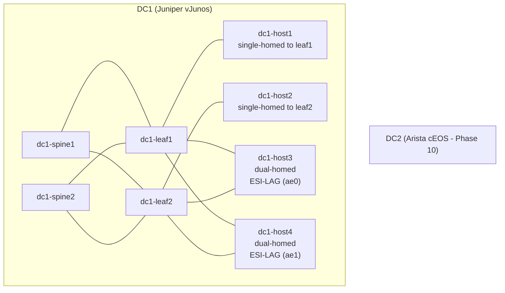

# EVPN-VXLAN Data Center Fabric - NetDevOps Lab

An automated EVPN-VXLAN data center fabric built with Infrastructure as Code principles. From planning in NetBox to configuration rendering, validation, and deployment - the entire lifecycle is code-driven, repeatable, and version-controlled.

## Architecture



**Topology summary:**
- Full-mesh spine-leaf fabric in DC1, each spine connects to each leaf.
- `dc1-host1` is single-homed to `dc1-leaf1`, and `dc1-host2` is single-homed to `dc1-leaf2`.
- `dc1-host3` is dual-homed to both leaves using ESI-LAG on `ae0`.
- `dc1-host4` is dual-homed to both leaves using ESI-LAG on `ae1`.

**Fabric design:**
- Juniper ERB (Edge-Routed Bridging) architecture on vJunos-switch (EX9214)
- eBGP underlay with unique ASN per device
- iBGP EVPN overlay with spines as route reflectors (AS 65000)
- VXLAN encapsulation with VNI-to-VLAN mapping
- ESI-LAG (EVPN multihoming) for active-active server connectivity
- Anycast gateway on IRB interfaces for distributed L3 routing

## Tech Stack

| Tool | Purpose |
|------|---------|
| [NetBox](https://netbox.dev/) | Source of Truth - devices, IPs, VLANs, ASNs, cabling |
| [Containerlab](https://containerlab.dev/) | Virtual network lab (vJunos-switch, Linux hosts) |
| [pynetbox](https://github.com/netbox-community/pynetbox) | Idempotent NetBox population via Python |
| [Nornir](https://nornir.readthedocs.io/) | Configuration rendering and deployment |
| [Batfish](https://www.batfish.org/) | Pre-deployment config validation |
| [Suzieq](https://suzieq.readthedocs.io/) | Continuous state observation + drift detection |
| Juniper Junos | Network OS (EVPN-VXLAN, ERB, ESI-LAG) |
| Arista EOS | Multi-vendor DC2 extension (planned) |

## Project Phases

| Phase | Description | Status |
|-------|-------------|--------|
| 1 | [NetBox as Source of Truth](phase1-netbox/) | Done |
| 2 | [EVPN+VXLAN+ESI-LAG Fabric](phase2-fabric/) | Done |
| 3 | [Nornir IaC Framework](phase3-nornir/) | Done |
| 4 | [Batfish Pre-Deployment Validation](phase4-batfish/) | Done |
| 5 | [Suzieq Continuous State + Drift Detection](phase5-suzieq/) | Done |
| 6 | GitHub Actions CI/CD Pipeline | In progress |
| 7 | Forwarding Scale + Convergence Tuning | Planned |
| 8 | CIS/PCI-DSS Hardening | Planned |
| 9 | gNMI Streaming Telemetry | Planned |
| 10 | Multi-DC DCI (Arista cEOS) | Planned |
| 11 | Controlled Lifecycle Operations | Planned |
| 12 | AI Copilot for Runtime Operations | Planned |

See [PROJECT_PLAN.md](PROJECT_PLAN.md) for detailed scope of each phase.

## Quick Start

```bash
# Clone the repo
git clone https://github.com/<your-user>/evpn-lab.git
cd evpn-lab

# Set up environment variables (IPs, tokens - not stored in repo)
cp .env.example .env
# Edit .env with your values, then:
source .env

# Phase 1: Populate NetBox
pip install -r phase1-netbox/requirements.txt
python phase1-netbox/populate.py
```

## Repository Structure

```
evpn-lab/
+-- README.md                 # This file
+-- PROJECT_PLAN.md            # 12-phase roadmap
+-- .env.example               # Environment variable template
+-- phase1-netbox/             # NetBox as Source of Truth
+-- phase2-fabric/             # EVPN+VXLAN+ESI-LAG fabric (containerlab)
+-- phase3-nornir/             # Nornir IaC: render, guard, deploy
    +-- tests/                 # Unit + integration tests (Phase 3 + Phase 6 extensions)
        +-- fixtures/render/   # Per-device canned HostData for golden-file tests
        +-- cassettes/         # vcrpy recorded NetBox HTTP cassettes (Phase 6)
+-- phase4-batfish/            # Pre-deployment offline validation
+-- phase5-suzieq/             # Continuous state observation + drift detection
+-- phase6-cicd/               # CI/CD infrastructure (Phase 6, Stages 2-4)
    +-- .github/workflows/     # fabric-ci.yml, fabric-deploy.yml
    +-- scripts/               # Cassette refresh, CI helpers
    +-- CI.md                  # CI operations documentation
```

## IP Addressing Plan

| Block | Purpose |
|-------|---------|
| 10.0.0.0/24 | Inter-DC P2P links |
| 10.1.0.0/16 | DC1 infrastructure (loopbacks, P2P) |
| 10.2.0.0/16 | DC2 infrastructure (Phase 10) |
| 10.10.0.0/16 | Tenant subnets stretched across DCs |
| 10.11.0.0/16 | DC1 local tenant subnets |
| 10.12.0.0/16 | DC2 local tenant subnets (Phase 10) |

Each DC summarizes to a single /16. See [Phase 1 docs](phase1-netbox/NETBOX_DATA_MODEL.md) for full details.

## Author

**Kamil Mazur** - [kmazur@goodhost.eu](mailto:kmazur@goodhost.eu)

## License

This project is licensed under the MIT License - see [LICENSE](LICENSE) for details.
