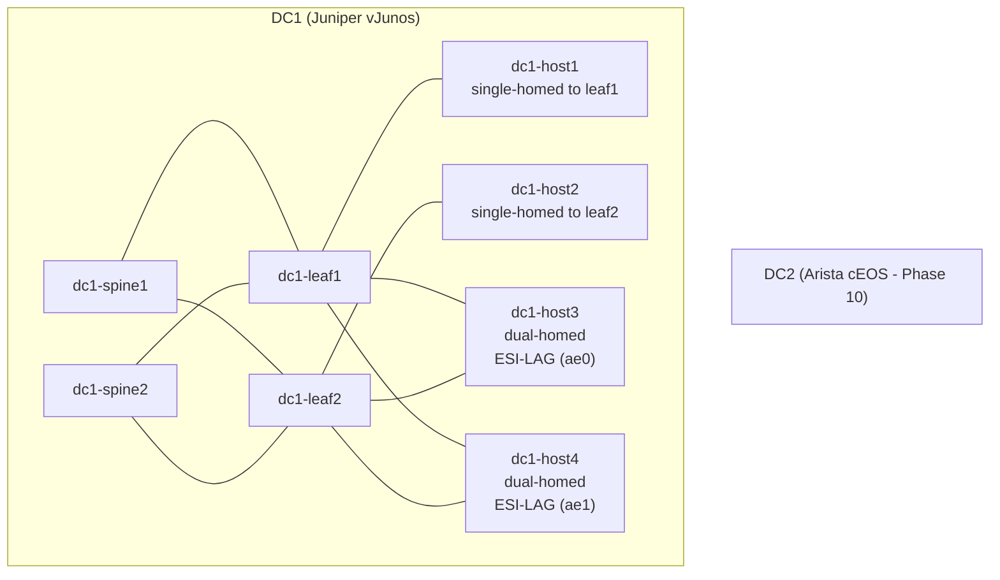

# EVPN-VXLAN Data Center Fabric - NetDevOps Lab

[](https://github.com/kmazur-tech/evpn-lab/actions/workflows/fabric-ci.yml)
[](https://github.com/kmazur-tech/evpn-lab/releases)

A Juniper EVPN-VXLAN fabric built end-to-end as code: NetBox is the source of truth, Nornir renders Junos configs from it, Batfish validates them offline, NAPALM commits behind a two-layer rollback (inner liveness gate + outer marker walk), smoke tests gate the deploy, and SuzieQ watches for drift afterwards. Every change goes through CI before it reaches a device, and every deploy can be reverted automatically when smoke or drift fails.

## What works today

- **EVPN-VXLAN fabric** running on containerlab with vJunos-switch (EX9214 model). 2 spines, 2 leaves, 4 hosts. Full-mesh underlay, EVPN overlay, VLAN-aware MAC-VRF, anycast gateways on IRB, ESI-LAG dual-homing.
- **NetBox-driven configs**: device data, VRFs, VLANs, VNIs, cabling, anycast MACs, RT scheme. `populate.py` is idempotent. Nornir's `enrich_from_netbox()` collects it all into a pydantic-validated `HostData` per device.
- **Render -> diff -> guard pipeline**: Jinja2 templates produce per-device configs, byte-diffed against checked-in golden files, then scanned for placeholders / malformed password hashes before any NAPALM call.
- **Batfish validation**: 7 offline checks (BGP topology, undefined references, parse status, IP ownership conflicts, ...) plus differential analysis vs `main`. PR-time CI posts the diff as a markdown PR comment via a `batfish/allinone` service container, with find-or-update so re-runs replace the comment instead of stacking.
- **Two-layer rollback on the deploy path.** Inner gate: `commit confirmed 120` + 30 s settle + per-host liveness check + `napalm_confirm_commit`; if any host loses SSH the confirm is skipped and Junos auto-rolls back at the deadline. Outer gate: every deploy commit carries a unique marker as the Junos commit comment, so `deploy.py --rollback-marker $MARKER` can walk `show system commit` per device and revert to pre-deploy state even after smoke's mid-run failover commits.
- **76-check smoke suite** runs after every commit (control plane, data plane, ESI failover, core isolation, spine failover, EVPN type 2/3/5 routes, ECMP, jumbo MTU). Roughly 2 minutes, all green on the live lab.
- **SuzieQ drift harness**: continuous state polling, NetBox-vs-runtime diff with strict assertion mode, time-series queries, schema-drift smoke test. 362 default tests + 12 live tests.
- **GitHub Actions CI/CD.** PR-time `fabric-ci.yml` on GitHub-hosted runners (lint, unit-test matrix across phases 3/4/5, render pipeline, Batfish - zero lab exposure). Manual `fabric-deploy.yml` on a self-hosted runner (lab-deploy environment with required reviewer): render-and-guard -> deploy with inner liveness gate -> smoke -> drift, with marker-based rollback if smoke or drift fails. End-to-end live-verified 2026-05-02..03: happy path; Variant 1 (smoke-fail -> marker walk reverts past smoke's intermediate commits); Variant 3 (liveness-fail -> Junos auto-rollback at exactly 2 min 1 s); Batfish PR-comment differential (post + find-or-update on PR re-run).

## Why this project is different

This isn't an EVPN tutorial repo. It's a working model of how to operate a network with the same engineering hygiene a software team would apply to any production system:

- **Single source of truth.** No config drift between docs, scripts, and devices: NetBox owns intent, everything else is derived from it.
- **Multiple independent validation layers** before a device sees a candidate config: golden-file regression, on-disk deploy guard, Batfish semantic checks, then NAPALM compare.
- **Self-correcting deploys, two ways.** A broken management plane (placeholder hash, mgmt VRF misconfig) trips the inner `commit confirmed 120` gate and Junos auto-rolls back. A passing inner gate that later fails smoke or drift triggers `deploy.py --rollback-marker`, which walks each device's commit history by the deploy's unique log line and reverts to pre-deploy state. The credential-lockout postmortem in Phase 3 is the reason this was built that way.
- **Continuous drift detection** post-deploy. SuzieQ keeps polling and a strict-assertions cron compares observed state against NetBox intent every 5 minutes.
- **CI gates real device-touching changes**, not just code style. Public repo, Actions runners sandboxed, secrets scoped to environments, all third-party Actions pinned to commit SHAs.

## 5-minute demo

If you have access to the lab server, the full pipeline runs in under 5 minutes once containerlab is up:

```bash
# 1. Populate NetBox from the YAML data model
python phase1-netbox/populate.py

# 2. Bring up the fabric (4x vJunos + 4x Linux hosts in containerlab)
sudo containerlab deploy -t phase2-fabric/dc1.clab.yml

# 3. Render Junos configs from NetBox, diff against golden files
cd phase3-nornir
python deploy.py --check                  # offline diff per stanza

# 4. Validate the rendered configs offline (Batfish on netdevops-srv)
python ../phase4-batfish/validate.py --snapshot build/

# 5. Deploy. Two-layer rollback: --liveness-gate runs `commit confirmed 120`,
#    waits 30s, runs liveness on every host, then napalm_confirm_commit.
#    --commit-message stamps a unique marker for the outer rollback.
python deploy.py --commit \
    --commit-message "manual-$(date +%s)" \
    --liveness-gate

# 6. Run the smoke gate (76 checks, ~2 min)
bash ../phase2-fabric/smoke-tests.sh

# 7. If smoke or drift later fails, revert via the marker:
#    python deploy.py --rollback-marker "manual-<timestamp>"

# 8. Compare runtime state vs NetBox intent
docker compose -f /opt/suzieq/docker-compose.yml run --rm drift --mode all
```

CI runs the same flow non-interactively via `fabric-deploy.yml` (workflow_dispatch on the self-hosted lab-deploy runner) where the marker is `cicd-${{ github.run_id }}-${{ github.run_attempt }}`.

If you don't have the lab, the offline pieces still run: `cd phase3-nornir && pytest` exercises the full render pipeline with vcrpy cassettes (zero NetBox / device dependencies, ~10 seconds).

## Pipeline at a glance

| Step | Tool | Input | Output |
|---|---|---|---|
| Source of truth | NetBox + `populate.py` | `netbox-data.yml` | Devices, VLANs, VNIs, VRFs, cables in NetBox |
| Render | Nornir + Jinja2 | NetBox API (or vcrpy cassettes in CI) | `phase3-nornir/build/<host>.conf` |
| Regression gate | `deploy.py --check` | Rendered configs | Byte-diff vs `phase3-nornir/expected/*.conf` |
| Deploy guard | `assert_safe_to_deploy` | Rendered configs on disk | Reject placeholders, validate hash shape |
| Validate | Batfish | Rendered configs + main baseline | 7 offline checks + differential snapshot |
| Deploy (inner gate) | NAPALM | Candidate config | `commit confirmed 120` + 30s settle + liveness + `napalm_confirm_commit`; auto-rollback if liveness fails |
| Smoke | `smoke-tests.sh` | Live fabric | 76-check pass/fail matrix |
| Rollback (outer gate) | `deploy.py --rollback-marker` | Device commit history | Walk `show system commit` per device, revert to pre-marker state if smoke or drift fails |
| Observe | SuzieQ + drift harness | Runtime state | Continuous diff vs NetBox intent |

## Architecture



**Topology summary:**
- Full-mesh spine-leaf fabric in DC1, each spine connects to each leaf.
- `dc1-host1` is single-homed to `dc1-leaf1`; `dc1-host2` to `dc1-leaf2`.
- `dc1-host3` and `dc1-host4` are dual-homed via ESI-LAG (`ae0` and `ae1`) to both leaves.

**Fabric design:**
- Juniper ERB (Edge-Routed Bridging) on vJunos-switch (EX9214)
- eBGP underlay, unique ASN per device
- iBGP EVPN overlay, spines as route reflectors (AS 65000)
- VXLAN encap, VNI-to-VLAN mapping
- ESI-LAG (EVPN multihoming) for active-active server connectivity
- Anycast gateway on IRB for distributed L3

## Evidence

### Smoke suite, post-deploy (76/76 PASS, ~2 minutes)

```
=== 1. Control Plane ===
  PASS: dc1-spine1 BGP: 0 down peers
  PASS: leaf1 EVPN routes: 42 destinations
  PASS: leaf1 VTEP tunnel to leaf2 (10.1.0.4)
  PASS: leaf1 BFD sessions up: 4
  PASS: leaf1 ESI all-active entries: 6
  PASS: leaf1 core-isolation configured

=== 4. Failover: ESI-LAG ===
  PASS: ESI-LAG: LACP detected leaf1 failure in 5s (active aggregator: 1 port)
  PASS: ESI-LAG failover: host3 -> host4 (leaf1 crashed)
  PASS: Post-failure withdrawal: leaf2 dropped remote VTEP 10.1.0.3 in 0s
  PASS: ESI-LAG restore: leaf1 recovered

=== 5. Failover: Core Isolation ===
  PASS: Core isolation: ae0 AND ae1 both brought down in 0s
  PASS: Core isolation: host3 -> host4 (leaf1 isolated, via leaf2)

=== 8. EVPN Deep Validation ===
  PASS: leaf1 ECMP: 10.1.0.4/32 installed via 2 next-hops (both spines)
  PASS: leaf1 EVPN Type-2 (VNI 10010): 12 MAC/IP routes
  PASS: leaf1 EVPN Type-5 (IP-prefix): 4 routes
  PASS: leaf1 MTU: jumbo (size 8972 DF) -> 10.1.0.4
  PASS: DF election: 2 ESIs, both leaves agree on DF

============================================
  ALL TESTS PASSED
============================================
```

### CI test counts (latest green run)

| Phase | Tests | Coverage | Runtime |
|---|---|---|---|
| Phase 1 (NetBox populate) | 18 | -- | <1 s |
| Phase 3 (Nornir IaC) | 177 | 87% | ~22 s |
| Phase 4 (Batfish) | 60 unit + 9 integration | -- | ~2 s |
| Phase 5 (SuzieQ) | 370 default + 12 live | 91.9% | ~4 s |
| **Total (default)** | **625** | -- | ~30 s |

### Render pipeline (offline)

Phase 3 `deploy.py --check` rendered against vcrpy cassettes, byte-diffed against `expected/`:

```
dc1-spine1 PASS
  OK    system
  OK    routing-options
  OK    chassis
  OK    interfaces
  OK    forwarding-options
  OK    policy-options
  OK    routing-instances
  OK    protocols
```

Same shape on all 4 devices. Any structural drift in a template surfaces here as a per-stanza DIFF before NAPALM is asked to do anything.

## Tech Stack

| Tool | Purpose |
|------|---------|
| [NetBox](https://netbox.dev/) | Source of truth - devices, IPs, VLANs, ASNs, cabling |
| [Containerlab](https://containerlab.dev/) | Virtual network lab (vJunos-switch, Linux hosts) |
| [pynetbox](https://github.com/netbox-community/pynetbox) | Idempotent NetBox population via Python |
| [Nornir](https://nornir.readthedocs.io/) | Configuration rendering and deployment |
| [NAPALM](https://napalm.readthedocs.io/) | Vendor-abstract device API; `commit confirmed` for the inner liveness gate, plain commit + Junos commit comment for the marker-based outer rollback |
| [Batfish](https://www.batfish.org/) | Pre-deployment config validation |
| [SuzieQ](https://suzieq.readthedocs.io/) | Continuous state observation + drift detection |
| Juniper Junos | Network OS (EVPN-VXLAN, ERB, ESI-LAG) |
| Arista EOS | Multi-vendor DC2 extension (planned) |

## Project Phases

| Phase | Description | Status |
|-------|-------------|--------|
| 1 | [NetBox as Source of Truth](phase1-netbox/) | Done |
| 2 | [EVPN+VXLAN+ESI-LAG Fabric](phase2-fabric/) | Done |
| 3 | [Nornir IaC Framework](phase3-nornir/) | Done |
| 4 | [Batfish Pre-Deployment Validation](phase4-batfish/) | Done |
| 5 | [SuzieQ Continuous State + Drift Detection](phase5-suzieq/) | Done |
| 6 | [GitHub Actions CI/CD Pipeline](phase6-cicd/) | Done (PR-time fabric-ci.yml + deploy fabric-deploy.yml with two-layer rollback, verified live 2026-05-02) |
| 7 | Dissolved (see [PROJECT_PLAN.md](PROJECT_PLAN.md#phase-7---dissolved-originally-routing-policy--multi-tenancy-preview)) | - |
| 8 | CIS/PCI-DSS Hardening | Planned |
| 9 | gNMI Streaming Telemetry | Planned |
| 10 | Multi-DC DCI (Arista cEOS) | Planned |
| 11 | Controlled Lifecycle Operations | Planned |
| 12 | AI Copilot for Runtime Operations | Planned |

See [PROJECT_PLAN.md](PROJECT_PLAN.md) for detailed scope of each phase.

## Lessons learned

A few real incidents that shaped the design. They are the reason certain layers exist:

- **Credential lockout from a placeholder hash (Phase 3).** A render bug produced placeholder password hashes; `deploy.py` committed them to all 4 devices and SSH locked everyone out. The fix is the two-layer safety model: a regression gate that compares against checked-in golden files, plus an independent on-disk `assert_safe_to_deploy()` that scans rendered bytes for sentinels and validates SHA-512 crypt shape before NAPALM is ever called. Documented in [phase3-nornir/README.md](phase3-nornir/README.md) "Safety - the two-layer guard".

- **Falsely blamed Junos for a SuzieQ pipeline artifact (Phase 5).** Drift detection started reporting "every BGP peer appears twice" - the working theory was Junos emitting duplicate state. Three hours of vendor-blame later, the actual root cause was a SuzieQ multi-command merge pipeline that produces partial-view rows during state transitions. The lesson: default to "your code is wrong, not the vendor's", and verify the raw output before reaching for a workaround. Now codified as a project rule and an explicit `_cleanup_bgp_phantom_rows()` helper.

- **vJunos MTU cap (Phase 2).** Real EX9214 supports 9216 MTU; the vJunos-switch image silently caps at 9192. Smoke test was sending 8972-byte (DF) pings between leaves - works at 9192 but would have failed on a real EX. The MTU constant lives in `vars/junos_defaults.yml` so the difference is one line, but the lesson is that emulation has invisible limits and the smoke suite needs to actively probe them.

- **LAG `system-id` regex bug invisible at small scale (Phase 3).** The original ESI-LAG `system-id` formula was `f"00:00:00:00:0{ae_index + 3}:00"` - works fine for `ae0..ae6` but produces `00:00:00:00:010:00` (an invalid 3-character octet) for `ae7+`. Phase 2 only had `ae0` and `ae1` so this hid for months. Caught by extending parametrized tests across the realistic range, not by the smoke suite or by manual review. Now [phase3-nornir/tests/test_lag_system_id.py](phase3-nornir/tests/test_lag_system_id.py) parametrizes over `ae0/1/6/7/12/13/252` and pins a 6-octet MAC regex.

- **`instance-import` does not work on vrf instance-type (Phase 7 PoC).** A Phase 7 plan iteration specified selective tenant-VRF leaking via `instance-import` policies. A 1-hour live PoC caught the assumption: Junos rejects `instance-import` on `instance-type vrf` with `'instance-import' not allowed on VPN instance`. The primitive applies to `virtual-router` and similar non-VPN instance-types only. EVPN multi-tenancy requires `vrf` for L3VNI signaling, so the primitive is structurally unavailable for this use case. The working alternative for selective cross-VRF leak with vrf instance-type is `routing-options rib-groups` with an `import-policy`, bound via `routing-instances <vrf> routing-options static rib-group <name>`. Lesson: VPN instance-types and virtual-router instance-types expose different sets of routing-options primitives. If a primitive appears in the docs, check which instance-type section it sits under before assuming it works for VRFs.

- **vJunos does not install novel Type-5 prefixes into the receiver VRF inet table (Phase 7 PoC).** While disambiguating the route-leak design, the PoC discovered that vJunos 23.2R1.14 receives Type-5 EVPN routes correctly into `bgp.evpn.0` and `<vrf>.evpn.0` with `Import Accepted`, but never installs them into `<vrf>.inet.0`. Tested across five origin configurations (rib-group static-discard, direct static-discard, direct static with real next-hop, attempted lo0 unit, fresh /29 prefix) - none propagate to the remote leaf. The lab's existing ERB design happens to mask this because every tenant subnet has a local anycast IRB Direct route on every leaf, so the Type-5 install path is never actually exercised in normal operation. Likely cause: incomplete PFE programming (the `forwarding-options vxlan-routing` hierarchy is parser-rejected on vJunos). Real EX9214 hardware does this correctly. Lesson: emulator gaps can hide behind anycast designs. The smoke suite passes because anycast IRBs provide local Direct routes, not because the Type-5 receive-side install is working - which on this image it isn't.

- **`add-path` is not for EVPN signaling family (Phase 7 PoC).** A Phase 7 plan iteration proposed BGP add-path send-receive on the spines for the EVPN overlay - a suggestion that came up in review and seemed obvious enough to plan around. Junos rejects this combination at commit-check time on every release tested (23.2 / 23.4 / 24.2): the YANG parser accepts the syntax, but the BGP module checker returns `BGP: Add-path configured on unsupported address-family`. The `add-path` family enum is restricted to `inet | inet6 | inet-vpn | inet6-vpn | iso-vpn`. For EVPN overlay multipath, the documented primitive is `multipath` on the BGP group, not `add-path`. Lesson: "should obviously work" is a tell. The standard EVPN-VXLAN reference designs use `multipath` and never mention `add-path` for the EVPN overlay - that absence was the diagnostic signal. The PoC caught it before scope was locked, but a doc check on the Junos add-path family enum would have caught it earlier.

## Repository Structure

```
evpn-lab/
+-- README.md                    # This file
+-- PROJECT_PLAN.md               # 12-phase roadmap
+-- .env.example                  # Environment variable template
+-- .github/workflows/            # GitHub Actions (fabric-ci.yml + fabric-deploy.yml)
+-- phase1-netbox/                # NetBox as Source of Truth
+-- phase2-fabric/                # EVPN+VXLAN+ESI-LAG fabric (containerlab + smoke)
+-- phase3-nornir/                # Nornir IaC: render, guard, deploy
|   +-- tests/                    # 177 unit/integration tests, vcrpy cassettes
|   +-- expected/                 # Golden file regression baselines
|   +-- templates/junos/          # Jinja2 templates per stanza
+-- phase4-batfish/               # Pre-deployment offline validation
+-- phase5-suzieq/                # Continuous state observation + drift detection
+-- phase6-cicd/                  # CI/CD docs, helper scripts (workflows live in .github/)
```

## IP Addressing Plan

| Block | Purpose |
|-------|---------|
| 10.0.0.0/24 | Inter-DC P2P links |
| 10.1.0.0/16 | DC1 infrastructure (loopbacks, P2P) |
| 10.2.0.0/16 | DC2 infrastructure (Phase 10) |
| 10.10.0.0/16 | Tenant subnets stretched across DCs |
| 10.11.0.0/16 | DC1 local tenant subnets |
| 10.12.0.0/16 | DC2 local tenant subnets (Phase 10) |

Each DC summarizes to a single /16. See [Phase 1 docs](phase1-netbox/NETBOX_DATA_MODEL.md) for the full object inventory.

## Author

**Kamil Mazur** - [kmazur@goodhost.eu](mailto:kmazur@goodhost.eu)

## License

MIT - see [LICENSE](LICENSE).
