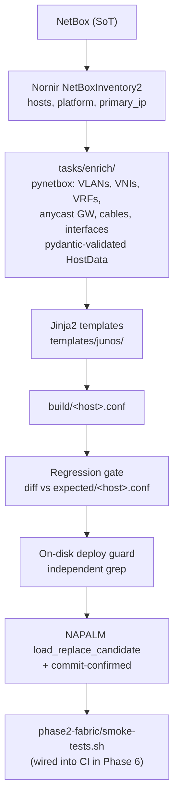

# Phase 3 - Nornir IaC

NetBox-driven Junos configuration rendering and deployment for the DC1 EVPN-VXLAN fabric.

**Run from:** WSL2 Debian on the workstation (or any Linux with the venv). `napalm-junos` + `junos-eznc` install cleanly on Linux but not on Windows. **Tests:** `cd phase3-nornir && pytest` (154 tests, 87% coverage, ~12 s, fully offline via vcrpy cassettes). **Depends on:** Phase 1 (NetBox populated). Live deploys also need lab SSH credentials in env.

## Pipeline



## Success criterion - the regression gate authority

Rendered configs match **`phase3-nornir/expected/*.conf`** byte-for-byte (ignoring `version`, `## Last changed`, and salted `encrypted-password` text). Any diff is either a template bug or a NetBox modeling gap and must be resolved before deploy.

`phase3-nornir/expected/` is the **renderer's contract with itself**: a snapshot of the last known-good output of `main.j2` for each device, committed to git. When a template changes, the workflow is:

```
python deploy.py --full       # render into build/
cp build/*.conf expected/     # refresh golden files
git add expected/ templates/  # commit template + baseline together
```

This is the **golden-file testing pattern** ([Nautobot Golden Config](https://docs.nautobot.com/projects/golden-config/en/latest/) uses the same idea). It catches accidental template changes between commits without coupling Phase 3 to any specific historic config.

### What about `phase2-fabric/configs/*.conf`?

`phase2-fabric/configs/*.conf` are the **clab startup configs** Phase 2 hand-wrote. They are loaded into vJunos at boot when `containerlab deploy` runs, then `python deploy.py --commit` overwrites the running config with the canonical-order rendered output. They are **not** the Phase 3 regression authority and do NOT need to match `expected/`. The two diverge intentionally:

- Phase 2 baselines have hand-written ordering and per-device random-salt password hashes (one-shot Junos-generated)
- Phase 3 expected/ has Junos canonical ordering and the deterministic `$6$evpnlab1$` hash from env

**Semantic validation** of intent (does this BGP session converge? are these prefixes reachable? do these ACLs block control plane?) is NOT done by the byte-diff regression gate - that's **Phase 4 (Batfish)** territory. The byte-diff catches structural template drift; Batfish will catch semantic intent drift.

## Layout

```
phase3-nornir/
  nornir.yml                 Inventory plugin = NetBoxInventory2
  vars/junos_defaults.yml    Platform/hardware constants ONLY (chassis, MTU,
                             BGP timers, fxp0 lab quirk). NEVER any auth-adjacent
                             material - that lives in env (see Secrets section).
  tasks/
    enrich/                  Per-domain NetBox enrichment, package layout:
      __init__.py              Re-exports public API (enrich_from_netbox,
                               derive_login_hash, helpers used by tests)
      models.py                Pydantic models for HostData and every
                               sub-shape (FabricLink, Lag, Irb, Tenant,
                               LoopbackUnit, BgpUnderlayNeighbor, ...).
                               Single validation point catches NetBox
                               schema drift before templates render.
      helpers.py               Pure helpers (lo0 unit parser, lo0
                               description mapper)
      auth.py                  derive_login_hash (env -> $6$ via passlib)
      interfaces.py            Fabric P2P + access + LAG members + ESI-LAG
                               parents + IRB collection
      loopbacks.py             lo0.* unit collection
      bgp.py                   Underlay + overlay neighbor derivation
      tenants.py               Tenant VRFs + MAC-VRF VLAN bindings
      main.py                  Nornir task entry point - calls each
                               collector, validates HostData, dumps to
                               task.host as plain dicts
    deploy.py                NAPALM napalm_configure (load_replace_candidate)
  templates/junos/
    main.j2                  Top-level: includes all partials in Junos order
    system.j2                hostname + auth (env-supplied real hash) + services
    chassis.j2               platform constants
    interfaces.j2            fabric P2P, access, LAG members, ESI-LAG, fxp0,
                             irb (anycast + leaf-local), lo0
    forwarding_options.j2    storm-control profile (leaves only)
    policy_options.j2        EXPORT-LOOPBACK, LOAD-BALANCE, EVPN community/policies
    routing_instances.j2     EVPN-VXLAN mac-vrf, tenant VRF, mgmt_junos
    routing_options.j2       router-id, graceful-restart, forwarding-table
    protocols.j2             BGP underlay/overlay, network-isolation, LLDP
  deploy.py                  Entry point with --check / --full / --dry-run / --commit
  build/                     Rendered output (gitignored, wiped at start of every run)
```

## Running

Run from WSL2 Debian. The venv `~/.venvs/evpn-lab` has nornir, nornir-netbox, nornir-napalm, nornir-jinja2, pynetbox, napalm, junos-eznc:

```
source ../../evpn-lab-env/env.sh        # all required env vars (see below)
~/.venvs/evpn-lab/bin/python deploy.py --check     # per-stanza diff vs baseline, no devices touched
~/.venvs/evpn-lab/bin/python deploy.py --full      # full main.j2 diff vs entire baseline file
~/.venvs/evpn-lab/bin/python deploy.py --dry-run   # full + on-disk guard + NAPALM compare_config
~/.venvs/evpn-lab/bin/python deploy.py --commit    # full + on-disk guard + NAPALM commit
```

`--commit` does NOT run smoke tests automatically. Run smoke separately:
```
bash ../phase2-fabric/smoke-tests.sh
```
Smoke is wired in as a CI stage in Phase 6 (`fabric-ci.yml`), not inside `deploy.py`.

## Secrets and credential material

The lab reads four credential-related env vars from `../../evpn-lab-env/env.sh` (outside the repo, gitignored):

| Variable | Purpose |
|----------|---------|
| `NETBOX_TOKEN` | NetBox API auth (intent fetch) |
| `JUNOS_SSH_USER` / `JUNOS_SSH_PASSWORD` | SSH login NAPALM uses to reach each device |
| `JUNOS_LOGIN_PASSWORD` | Plaintext password rendered into the device login config |
| `JUNOS_LOGIN_SALT` | Fixed crypt(3) salt for deterministic SHA-512 hash derivation |

`JUNOS_LOGIN_PASSWORD` and `JUNOS_LOGIN_SALT` are fed to `passlib.hash.sha512_crypt` (pure-Python `builtin` backend, `rounds=5000`) at render time to produce a stable `$6$<salt>$<86char>` hash. The hash is deterministic - re-rendering produces the same bytes - so deploys are idempotent. Verified byte-identical to glibc `crypt()` for the lab's existing committed hashes; passlib replaced stdlib `crypt` because the latter is deprecated in Python 3.13 and removed in 3.14.

The salt is NOT cryptographically secret (it appears in clear inside the rendered hash), but it IS environment-specific. Different deployments of this lab pick different salts and store them as part of their credential bundle.

### PRODUCTION: pull credentials from a vault, not an env file

For lab use we keep `evpn-lab-env/env.sh` outside the repo and source it manually. **For production this is NOT acceptable.** Replace the env-file approach with:

- **HashiCorp Vault**: `vault kv get -format=json secret/junos/login` -> shell exports, or use the `hvac` Python client directly inside `deploy.py` and `tasks/enrich/auth.py` to fetch values at task time.
- **AWS Secrets Manager / GCP Secret Manager / Azure Key Vault**: same pattern via the corresponding cloud SDK.
- **sops + age/PGP** or **git-crypt**: encrypted secrets in the repo, decrypted on demand.

The contract `deploy.py` expects is: at task entry time, `os.environ["JUNOS_LOGIN_PASSWORD"]` and `os.environ["JUNOS_LOGIN_SALT"]` are populated with real values. Where they came from is up to the operator. A vault-backed entry script wraps `deploy.py`:

```bash
#!/usr/bin/env bash
# vault-deploy.sh - production wrapper
set -euo pipefail
eval "$(vault kv get -format=json secret/evpn-lab/junos | \
  jq -r 'to_entries[] | "export \(.key)=\(.value | @sh)"')"
exec python /opt/evpn-lab/phase3-nornir/deploy.py "$@"
```

The repo never sees the values; `deploy.py` never reads files; rotation is a vault update plus a re-deploy.

## Safety - the two-layer guard

`deploy.py` has two independent safety layers. The historical reason for the two-layer model was a credential lockout incident: a render bug produced placeholder hashes, deploy.py committed them to all 4 devices, SSH locked everyone out. The on-disk guard exists to make sure that class of bug never reaches NAPALM in the first place.

| Layer | What it checks | Purpose |
|-------|----------------|---------|
| **Regression gate** (`render_full_and_diff`) | Rendered config == `phase3-nornir/expected/<host>.conf` golden file (with normalized noise: salted hashes, version line, timestamps) | "Templates produce structurally identical output to the last known-good render" |
| **On-disk deploy guard** (`assert_safe_to_deploy`) | `build/<host>.conf` contains no sentinel strings (`PLACEHOLDER`, `render-time-only`, `<HASH>`, `TODO`, `REPLACE_ME`) AND every `encrypted-password` line matches `^encrypted-password "\$6\$[^$]+\$[A-Za-z0-9./]{86}"$` | "The bytes that will be loaded onto the device contain real, valid credential material" |

Both must pass before NAPALM is called. The regression gate normalizes salted-hash text because the content is opaque noise; the deploy guard scans the unmodified rendered file independently.

NAPALM `compare_config` is honest: it shows full encrypted-password changes in its diff output (verified empirically against the live fabric - both old and new hash values appear in the diff stanza for `[edit system root-authentication]`). The reason placeholder values would be dangerous is NOT that NAPALM hides them, but that NAPALM faithfully commits whatever bytes the renderer hands it. The on-disk guard's job is to make sure those bytes are valid before NAPALM ever sees them.

If you add a new template that emits a secret field, you MUST extend the guard's shape regex (or sentinel list) to validate it. The guard exists because diff normalizers (which strip salted-hash noise so the regression gate can compare configs cleanly) must never touch the file on disk - the bytes NAPALM commits have to be the real values, and the guard catches bad bytes before NAPALM ever sees them.

## Tests

Unit tests and integration tests under `tests/`. No NetBox, no devices, no env vars (each test that needs env uses `monkeypatch`). Run from WSL2:

```
cd phase3-nornir
~/.venvs/evpn-lab/bin/pip install -r requirements-dev.txt   # one-time
~/.venvs/evpn-lab/bin/python -m pytest
```

### Phase 3 original tests (104 tests, ~2.7 sec)

| File | What it pins | Why it matters |
|------|--------------|----------------|
| `test_deploy_guard.py` | `assert_safe_to_deploy()` rejects every sentinel + every malformed hash shape (placeholder, truncated, cleartext, MD5, empty); accepts a clean config | This is the layer whose absence caused the credential lockout. Every regression here is a deploy that could lock out the lab. |
| `test_extract_stanza.py` | Brace-balanced Junos stanza extraction: top-level, nested, indented, missing, substring-no-match, first-match | Used by the regression gate for every per-stanza diff. Bugs here = false PASS or false FAIL. Documents the known limitation of `}` inside string literals. |
| `test_normalize.py` | Diff normalizer rules + idempotence + non-secret-fields-untouched | Pins the boundary between "regression-diff noise" and "deploy-critical content". Any change to this function MUST come with deploy guard tests proving placeholder hashes still get caught. |
| `test_enrich_helpers.py` | `_lo0_unit_from_iface_name()`, `_loopback_description()`, `derive_login_hash()` (deterministic, hard-fail on missing env) | Pure mappers easy to break on refactor; the hash derivation is the postmortem fix verified to fail-fast. |
| `test_enrich_pure.py` | `collect_underlay_neighbors()` IP sorting + pydantic `extra="forbid"` contracts + type validation + field defaults | Pins the schema contract between enrich and templates. |
| `test_transform.py` | `fabric_inventory_transform()` mgmt-IP/platform/credential mutation | Idiomatic Nornir contract; broken transform = unreachable deploy. |
| `test_lag_system_id.py` | LAG system-id and admin-key formulas (`f"00:00:00:00:{(ae_index + 3):02x}:00"`) parametrized over ae0/1/6/7/12/13/252 with valid 6-octet MAC regex check; explicit "Phase 2 baselines unchanged" guard | The old formula `f"00:00:00:00:0{ae_index + 3}:00"` produced an invalid 3-char octet for ae7+. Fix verified byte-identical for ae0/1 (the only LAGs in Phase 2) so no expected/ regen needed. |
| `test_napalm_diff_contract.py` | `napalm_deploy()` correctly reads `out[0].diff` (not `.result`) from the wrapped napalm_configure call; passes `revert_in=300` only when committing; uses `replace=True`; loads config bytes from `build/<host>.conf` not memory | Pins the contract that was broken by the original `out.result or ""` bug. Empty diffs print "no diff", real diffs print the diff text. Verified to FAIL 6/6 when the bug is reintroduced. |
| `test_validate_flag.py` | Phase 4 Batfish hook wiring: argv construction, exit code propagation, missing-script sentinel | Pins the --validate integration with phase4-batfish/validate.py. |

### Phase 6 test extensions (added to this directory because they test Phase 3 code)

Tests added by Phase 6 Stage 1. They live here (not in `phase6-cicd/`) because they import from `deploy` and `tasks.enrich`. CI-specific infrastructure (workflow YAML, refresh scripts, CI docs) lives in `phase6-cicd/`.

| File | What it pins | Status |
|------|--------------|--------|
| `test_render_golden.py` | Full main.j2 render against canned fixture data for all 4 devices, normalized byte-equality against `expected/*.conf`. Plus structural role checks (spine vs leaf: forwarding-options, cluster RR, network-isolation, EVPN-VXLAN, deploy sentinels). 24 tests. | Done |
| `test_enrich_vcr.py` | `enrich_from_netbox()` end-to-end with vcrpy cassettes recorded against lab NetBox. Validates enriched HostData matches fixture data. | Planned |
| `test_napalm_tasks.py` | Mocked NAPALM two-stage commit-confirm flow, liveness check, `revert_in=300` contract. | Planned |
| `test_nornir_per_device.py` | pytest-nornir parametrized runner: each device as a row in CI test summary. | Planned |

Fixture data for golden-file tests lives in `tests/fixtures/render/*.json` (one JSON per device, containing the canned HostData that `enrich_from_netbox()` would produce). vcrpy cassettes will live in `tests/cassettes/` once recorded.

What's intentionally NOT tested here:
- Live deploy / smoke (covered by manual deploy + lab-server smoke; wired into Phase 6 CI deploy workflow)
- Semantic intent validation (Phase 4 Batfish territory)

## Phased rollout

For a first commit on a fresh template (or after a recovery), commit one device at a time and verify health between each. The Nornir `nr.filter()` API supports this:

```python
single = nr.filter(name="dc1-spine2")    # least-impactful spine
single.run(task=napalm_deploy, ...)
```

Smoke + manual SSH check between rollout steps. Only after the first device is confirmed do you fan out to the rest.

## Known limitations (Phase 3 scope)

These are deliberate Phase 3 simplifications, not bugs. Each is scoped to a specific later phase where it gets generalized with a real second case driving the design (premature abstraction without a second case is worse than a documented limitation).

### Single-tenant MAC-VRF assumption

`templates/junos/routing_instances.j2` renders a single `EVPN-VXLAN` MAC-VRF instance and indexes `host.tenants[0]` for the route-distinguisher's `tenant_id` and for the `vrf-import` / `vrf-export` policy names. This works because the Phase 3 lab has exactly one tenant (TENANT-1).

The pydantic `HostData.tenants` list shape already supports multiple tenants - the limitation is **in this template only**. Phase 7 (multi-tenant) will replace `host.tenants[0]` with explicit iteration in one of two ways:

- **(a)** one `mac-vrf` instance per tenant (`EVPN-VXLAN-<TENANT>` blocks)
- **(b)** a single `mac-vrf` instance carrying all tenants' VNIs and importing/exporting every tenant route-target

Both options keep the enrich layer untouched. The choice between (a) and (b) is a fabric-design call best made when a real second tenant exists.

### Single-fabric data derivation

`tasks/enrich/interfaces.py` filters fabric peers via the hardcoded prefix tuple `("dc1-spine", "dc1-leaf")`. Phase 10 (multi-DC) will replace this with a NetBox-driven device-role lookup so DC2's Arista cEOS devices are picked up automatically.

### Phase 2 hand-built configs as clab startup state

`phase2-fabric/configs/*.conf` are loaded into vJunos at clab boot. Phase 3 `--commit` overwrites the running config with the canonical-order rendered output. The two intentionally diverge in ordering and password hash. Long-term (Phase 6 CI), the clab boot config could be replaced with a "Phase 3 render at boot" hook so the lab starts in canonical state, but that's outside Phase 3 scope.

### Lab-scope env-file secrets (not vault-backed)

Documented above in the "Secrets and credential material" section. The vault-backed wrapper pattern is described and ready to drop in; the env file is the deliberate lab-scope choice.

### Same hash for root and admin accounts

`deploy.py` calls `derive_login_hash()` once and assigns the same value to both `junos_root_hash` and `junos_admin_hash`. Both accounts therefore use the same plaintext from `$JUNOS_LOGIN_PASSWORD`. The CIS Junos benchmark requires unique credentials per account, so Phase 8 (CIS/PCI-DSS hardening) will split this into `JUNOS_ROOT_PASSWORD` and `JUNOS_ADMIN_PASSWORD` env vars and derive two distinct hashes. The `system.j2` template already takes the two hashes as separate variables - the change is one-line in `deploy.py`.

### N+1 NetBox API queries during enrich

`tasks/enrich/` makes per-object pynetbox REST calls in several loops: per-interface IP fetches, per-cable termination lookups, per-VRF prefix fetches, etc. For 4 fabric devices this is ~50 calls per host, ~2 sec total. For Phase 10 (8 devices, +DC2) it's still acceptable. Beyond that it becomes a bottleneck.

The Phase 10 plan documents the GraphQL refactor (one query per device, ~10x faster) as the structured fix. Until then, the per-host enrich time scales linearly and may add seconds in CI runs against larger fabrics.

### No retry/timeout on pynetbox calls

If NetBox is briefly unreachable during an enrich run, the entire Nornir task fails immediately. No retry loop, no configurable timeout. Acceptable for the lab where NetBox is on a local VM. **Phase 6 (CI) will need this** - flaky CI runs against a remote NetBox would be hard to debug. The fix is a `requests.Session` with an `HTTPAdapter` retry policy mounted onto `nb.http_session`. ~10 line change, defer to Phase 6 alongside vcrpy cassettes.

### No template semantic validation (Jinja semantics beyond byte-equality)

Phase 6 Stage 1 added `test_render_golden.py` which renders full templates against canned fixture data and asserts byte-equality with `expected/*.conf`. This catches structural template drift. Semantic intent validation (does this BGP session converge? are these prefixes reachable?) is **Phase 4 (Batfish)** territory.

### `vpn-apply-export` on the spine OVERLAY group is intentionally absent

External reviewers occasionally flag this as missing. It's not a bug - see [phase2-fabric/DESIGN.md "vpn-apply-export on the spine OVERLAY group - rejected"](../phase2-fabric/DESIGN.md). Short version: `vpn-apply-export` is an L3VPN-era knob that is a no-op on `family evpn signaling` on a route reflector (the spine has no routing-instances and no `vrf-export` policy to apply). The legitimate underlying concern (RR sending traffic the recipient discards) is real at multi-tenant scale; the correct mechanism is BGP Route Target Constrain (RFC 4684 / Junos `family route-target`), which is overkill for 1 tenant on 2 leaves and adds an address family the smoke suite would have to validate. Revisit when the lab grows past 4 tenants on 4+ leaves.
