# Phase 6 - GitHub Actions CI/CD Pipeline

PR-time validation and (eventually) lab deployment for the EVPN-VXLAN fabric, glued onto the work done in phases 1-5. Every change to NetBox data, templates, or automation code now runs through render -> diff -> guard -> Batfish in a sandboxed CI runner before it can merge.

## Layout

GitHub Actions workflow files **must** live at `.github/workflows/` in the repo root - that's a hard GitHub requirement, not a project preference. Everything else (docs, helper scripts, cassette refresh tooling) lives here under `phase6-cicd/`:

```
.github/                                <- repo root, required by GitHub
  workflows/
    fabric-ci.yml                       PR-time CI (this phase)
    fabric-deploy.yml                   Lab deploy workflow (Phase 6.3, planned)
  yamllint.yml                          yamllint config used by the lint job
  dependabot.yml                        Weekly Action SHA updates

phase6-cicd/                            this directory
  README.md                             this file
  scripts/
    refresh-netbox-cassettes.py         Re-records vcrpy cassettes from live NetBox
```

## Status

Stage | Scope | State
---|---|---
6.1 | Test framework extensions (golden-file render, vcrpy enrich, mocked NAPALM, pytest-nornir) | Done. 154 phase-3 tests, 87% coverage, all offline.
6.2 | PR-time `fabric-ci.yml`: lint + unit matrix + render-pipeline + batfish | Done. Runs on every PR and push to `main`.
6.3 | Deploy `fabric-deploy.yml`: containerlab up, commit-confirmed, smoke gate, suzieq drift, teardown | Planned. Self-hosted runner, manual `workflow_dispatch`.
6.4 | Documentation, status badge, `phase6-cicd/CI.md` operations runbook | Partial - this README covers what's live; runbook follows when deploy lands.

## End-to-end pipeline

```mermaid
flowchart LR
    pr["PR opened<br/>or push to main"]
    lint["lint<br/>yamllint + ruff + j2lint"]
    unit["unit (matrix)<br/>phase3 / phase4 / phase5"]
    render["render + diff + guard<br/>(vcrpy cassettes)"]
    bf["batfish<br/>offline unit tests"]
    merge["merge to main"]

    dispatch["operator triggers<br/>workflow_dispatch"]
    env["lab-deploy environment<br/>required reviewer"]
    deploy["nornir-commit<br/>commit-confirmed (revert_in=300)"]
    smoke["smoke-tests.sh<br/>76 checks via SSH to lab"]
    confirm["napalm_confirm_commit"]
    rollback["Junos auto-rollback<br/>at 5-min deadline"]
    drift["suzieq drift check<br/>soft-fail"]

    pr --> lint --> unit --> render --> bf --> merge

    merge -.-> dispatch
    dispatch --> env --> deploy --> smoke
    smoke -- PASS --> confirm --> drift
    smoke -- FAIL --> rollback
```



The PR-time loop on the left runs on GitHub-hosted runners, fully offline, on every push. The deploy loop on the right is manual `workflow_dispatch`, runs on a self-hosted runner gated by the `lab-deploy` GitHub Environment with required reviewer.

### What blocks what

| Stage | Blocks merge to main? | Blocks deploy to lab? |
|---|---|---|
| `lint` | Yes | -- |
| `unit (phase3-nornir)` | Yes | -- |
| `unit (phase4-batfish)` | Warn-only\* | -- |
| `unit (phase5-suzieq)` | Warn-only\* | -- |
| `render + diff + guard` | Yes | -- |
| `batfish` | Yes | -- |
| Required reviewer on `lab-deploy` env | -- | Yes |
| `nornir-commit` (commit-confirmed) | -- | Yes (planned) |
| `smoke` (76-check gate) | -- | Yes (planned) - if fails, no confirm fires and Junos auto-rolls back |
| `suzieq-drift` | -- | Soft-fail (planned) - warn in summary, do not block |

The PR side is biased toward fast feedback and offline checks. The deploy side is biased toward safety: every device-touching step has a fail-safe (commit-confirmed timer, manual approval gate, post-deploy drift verification).

## fabric-ci.yml - PR-time workflow

Triggered on every PR and push to `main`. Runs on GitHub-hosted `ubuntu-latest`, not the self-hosted lab runner - the public repo means PR contributors' code runs in CI, and we want that on GitHub's sandbox, not on infrastructure that has SSH keys to the lab. PR-time CI doesn't need lab access (vcrpy cassettes replay NetBox offline, NAPALM is mocked, Batfish unit tests use captured fixtures), so the GitHub-hosted runner is sufficient.

Jobs:

| Job | What it does | Hard-fail? |
|---|---|---|
| `lint` | yamllint + ruff + j2lint across all phase dirs | Yes |
| `unit (phase3-nornir)` | Full pytest suite, 154 tests, coverage gate at 85% | Yes |
| `unit (phase4-batfish)` | pybatfish unit tests, 60 tests | Warn-only* |
| `unit (phase5-suzieq)` | Drift harness suite, 362 tests | Warn-only* |
| `render + diff + guard` | Render templates from cassettes, byte-equality vs `expected/`, deploy-guard scan | Yes |
| `batfish` | pybatfish unit tests with captured fixtures | Yes |

\* Phase 4 and Phase 5 unit suites start as `continue-on-error: true` and transition to hard-fail after **5 consecutive green PRs OR 14 calendar days** from when this workflow first lands, whichever comes first. The transition date will be recorded here when it happens.

### Workflow security baseline

- **Workflow-level `permissions: {}`** - empty by default; each job declares its own minimal scope (`contents: read`, plus `pull-requests: write` only on the batfish job for future PR comments).
- **All Actions pinned to full commit SHAs** - tag-only refs (`@v4`) are blocked by the repo's "Require actions to be pinned to a full-length commit SHA" setting. Dependabot opens PRs to bump SHAs weekly.
- **Allowed actions allowlist** - repo settings restrict to `actions/*, github/*` plus anything under the `kmazur-tech` org. Marketplace-verified-creator shortcut is off.
- **Fork PR approval gate** - "Require approval for all external contributors" set in repo Actions settings; a maintainer has to click approve before any fork PR can spin up a runner.
- **Concurrency cancel-in-progress** - new push to a branch cancels the still-running CI for the previous push on that branch.

### Caching and artifacts

- pip cache keyed per-phase by hash of `requirements*.txt`. First run is a cache miss (one warning per job, expected); subsequent runs reuse the cache and skip the install delay.
- Phase 3 coverage HTML uploaded as `coverage-phase3-nornir`, 14-day retention.
- Rendered configs uploaded as `rendered-configs` from the render job, 14-day retention - lets you grab the produced configs from a failed PR without re-running the full pipeline.

## vcrpy cassettes

The `render + diff + guard` job runs `enrich_from_netbox()` against pre-recorded HTTP cassettes instead of a live NetBox. Cassettes live in [`phase3-nornir/tests/cassettes/`](../phase3-nornir/tests/cassettes/), one per device. They are checked into git so CI is fully offline.

Cassettes need a refresh whenever the NetBox schema changes (e.g. NetBox version bump) or when the lab data model changes (new devices, new VRFs). Refresh procedure:

```bash
# From a host that can reach the lab NetBox
cd phase3-nornir
source ../../evpn-lab-env/env.sh   # NETBOX_URL + NETBOX_TOKEN
python ../phase6-cicd/scripts/refresh-netbox-cassettes.py
```

The refresh script automatically:
- Replaces the real NetBox host with the placeholder `netbox.lab.local` (no infrastructure IPs leak into the repo).
- Strips `Authorization` headers.
- Writes one cassette per device into `phase3-nornir/tests/cassettes/`.

The CI render job warns when cassettes are older than 30 days. The warning doesn't block, but it's a hint that the snapshot is drifting from production NetBox.

## fabric-deploy.yml - lab deploy workflow

`workflow_dispatch` only -- never triggered by a PR or push. Manual invoke only, behind the `lab-deploy` GitHub Environment with required reviewer. Runs entirely on the self-hosted `lab-deploy` runner on netdevops-srv.

Job chain:

```
render-and-guard -> commit-no-confirm -> smoke-gate -> { confirm | rollback-notice }
                                                          \
                                                           +-> drift-check (soft-fail)
```

- **render-and-guard**: live NetBox read via Phase 3 enrich, full template render, byte-diff vs `expected/`, on-disk sentinel guard, then **Phase 4 Batfish offline analysis** (7 checks + differential vs `main`) against the rendered build. No device contact. ~2 min.
- **commit-no-confirm**: `deploy.py --commit --no-confirm`. Loads candidate config and starts a 5-minute commit-confirmed timer on every device. Job exits as soon as devices acknowledge -- it does NOT confirm. ~30 s.
- **smoke-gate**: SSH to `gha-smoke@172.16.18.108`, run `sudo /usr/local/bin/lab-smoke`. The 76-check smoke suite runs against the live fabric. Pass -> the next job runs. Fail -> the rollback-notice job logs what's about to happen, and Junos auto-rolls back when the timer fires. ~2 min.
- **confirm**: `deploy.py --confirm-only`. Runs only on smoke pass. Clears the rollback timer on every device. ~10 s.
- **rollback-notice**: runs only on smoke fail (`if: failure()` on `smoke-gate`). Just prints what's happening. The rollback itself is automatic.
- **drift-check**: Phase 5 drift harness in `--mode assertions` (the lightweight, NetBox-free path). Runs only after a successful confirm. Soft-fail (`continue-on-error: true`) -- a transient assertion failure here does not roll back the deploy, but it does surface a verification warning. Tightens the verification loop to right-after-deploy; the same harness runs every 5 minutes via `suzieq-drift-assert.timer` regardless. ~10 s.

The integration of all five prior phases is the architectural point of this workflow: Phase 1 (NetBox source of truth) drives Phase 3 (Nornir render) which is gated by Phase 4 (Batfish) before deploy and verified by Phase 2 smoke + Phase 5 drift after deploy. Each gate is independent, each catches a different class of failure.

The architectural property: **smoke is the deploy gate, not the cheap liveness check**. `deploy.py --commit` (the manual operator path) uses liveness because a manual deploy has a human running smoke afterwards. CI deploy splits the commit + confirm so the full smoke suite can run between them. The two new flags `--no-confirm` and `--confirm-only` exist exactly for this split.

### Self-hosted runner setup

Performed once on `netdevops-srv` (already done as of v0.5.x):

```bash
# As root: create non-root runner user
useradd -m -s /bin/bash -c "GitHub Actions Runner" gha-runner

# As gha-runner: download, register, run as systemd service.
# Registration token comes from GitHub: Settings -> Actions -> Runners
# -> New self-hosted runner. Single-use, ~1h expiry.
sudo -iu gha-runner bash -c '
  mkdir -p ~/actions-runner && cd ~/actions-runner
  curl -sL -o runner.tar.gz \
    https://github.com/actions/runner/releases/download/v2.334.0/actions-runner-linux-x64-2.334.0.tar.gz
  tar xzf runner.tar.gz && rm runner.tar.gz
  ./config.sh --url https://github.com/kmazur-tech/evpn-lab \
              --token <REGISTRATION_TOKEN> \
              --name netdevops-srv-gha --labels lab-deploy \
              --replace --unattended
'

# As root: install + start systemd service running as gha-runner
cd /home/gha-runner/actions-runner
./svc.sh install gha-runner
./svc.sh start
```

Operational commands:

```bash
# Status / logs
ssh root@netdevops-srv 'cd /home/gha-runner/actions-runner && ./svc.sh status'
ssh root@netdevops-srv 'journalctl -u actions.runner.kmazur-tech-evpn-lab.netdevops-srv-gha -f'

# Stop / start
ssh root@netdevops-srv 'cd /home/gha-runner/actions-runner && ./svc.sh stop'
ssh root@netdevops-srv 'cd /home/gha-runner/actions-runner && ./svc.sh start'

# Full rebuild after suspicious activity. Mint a new registration
# token from GitHub UI before running.
ssh root@netdevops-srv 'cd /home/gha-runner/actions-runner && ./svc.sh stop && ./svc.sh uninstall'
ssh root@netdevops-srv 'sudo -u gha-runner /home/gha-runner/actions-runner/config.sh remove --token <REMOVAL_TOKEN>'
# Then redo the install procedure with a fresh registration token.
```

The runner is **persistent** (not ephemeral). True ephemeral mode requires a long-lived PAT to mint per-job registration tokens, which is its own credential management problem. For a lab triggered manually, `gha-runner` as a dedicated non-root user with a documented rebuild path is the practical security baseline. Listed under Production readiness below.

### Lab-server smoke runner (`gha-smoke`)

The smoke job SSHes from the runner (on netdevops-srv) into the lab server (172.16.18.108) and runs the 76-check smoke suite. The lab server is where containerlab + Docker live, which is why smoke must run there: `smoke-tests.sh` uses `nsenter` and `docker exec` against the host's Docker daemon.

Trust model:

- A dedicated `gha-smoke` user exists on the lab server with no password and no shell escape into anything else.
- Its `~/.ssh/authorized_keys` accepts only the Ed25519 public key generated by `gha-runner` on netdevops-srv. The private half lives at `/home/gha-runner/.ssh/lab_server` on the runner.
- The runner's SSH key is **not** a GitHub secret. It lives on the runner filesystem, owned by `gha-runner`, mode 600. If the runner is rebuilt, the key is regenerated and the public half is re-authorised on the lab server.
- A wrapper at `/usr/local/bin/lab-smoke` is the only command `gha-smoke` is permitted to run via sudo (no password). It rejects any argument and execs `bash /opt/evpn-lab/smoke-tests.sh` after sourcing `/opt/evpn-lab-env/env.sh` (which has the lab credentials needed by smoke -- never fetched from CI, never crosses the network).
- `gha-smoke` cannot run any other sudo command; the sudoers entry is exact-path-match, so any other binary needs a password it does not have.

Setup (performed once on the lab server):

```bash
# As root on 172.16.18.108
useradd -m -s /bin/bash -c "GitHub Actions smoke runner" gha-smoke

mkdir -p /home/gha-smoke/.ssh
chmod 700 /home/gha-smoke/.ssh
echo '<public key from /home/gha-runner/.ssh/lab_server.pub on netdevops-srv>' \
  > /home/gha-smoke/.ssh/authorized_keys
chmod 600 /home/gha-smoke/.ssh/authorized_keys
chown -R gha-smoke:gha-smoke /home/gha-smoke/.ssh

cat > /usr/local/bin/lab-smoke <<'WRAPPER'
#!/bin/bash
set -euo pipefail
if [ "$#" -ne 0 ]; then
  echo "lab-smoke takes no arguments" >&2
  exit 2
fi
source /opt/evpn-lab-env/env.sh
exec bash /opt/evpn-lab/smoke-tests.sh
WRAPPER
chmod 755 /usr/local/bin/lab-smoke

cat > /etc/sudoers.d/gha-smoke <<'SUDOERS'
gha-smoke ALL=(root) NOPASSWD: /usr/local/bin/lab-smoke
Defaults:gha-smoke !requiretty
SUDOERS
chmod 440 /etc/sudoers.d/gha-smoke
visudo -cf /etc/sudoers.d/gha-smoke
```

Verification path (from a workstation that can reach netdevops-srv):

```bash
ssh root@netdevops-srv \
  'sudo -iu gha-runner ssh -i /home/gha-runner/.ssh/lab_server \
       -o BatchMode=yes gha-smoke@172.16.18.108 \
       "sudo /usr/local/bin/lab-smoke"'
# Expect: full smoke output, "ALL TESTS PASSED" at the bottom.
```

The trust boundary: a compromise of the GitHub Actions runner gets at most `bash /opt/evpn-lab/smoke-tests.sh` on the lab server -- read-only of fabric state plus a known set of tests. It does NOT get arbitrary code execution as root on the lab server.

### Required GitHub Environment

`lab-deploy` Environment (Repo Settings -> Environments):
- **Required reviewer**: at least one (the maintainer who didn't trigger). Lab is single-operator so self-review is acceptable; production must not allow self-review.
- **Wait timer**: optional. Lab uses 0; production may want a few minutes to allow cancellation.
- **Environment secrets**:
  - `NETBOX_TOKEN` -- pynetbox API token for live NetBox read during render
  - `JUNOS_LOGIN_PASSWORD` -- plaintext, fed to passlib SHA-512 for the rendered hash
  - `JUNOS_LOGIN_SALT` -- crypt salt (`$6$evpnlab1$`)
  - `JUNOS_SSH_USER` -- lab device SSH user
  - `JUNOS_SSH_PASSWORD` -- lab device SSH password

Repo-level secrets: none. The PR-time CI does not use any secrets at all (vcrpy cassettes, mocked NAPALM, captured Batfish fixtures).

## Production readiness checklist

This lab is a showcase, not a production deployment. The CI is designed to be honest about that gap. Before this pipeline could safely promote real device changes in a production environment:

- [ ] **Deploy authorization gate.** GitHub Environment `lab-deploy` with required reviewers (a human approves every device-touching deploy). Lab uses single-operator dispatch; production must not.
- [ ] **Self-hosted runner hardening.** Ephemeral / JIT mode (each job in a fresh environment), dedicated runner group locked to this repo, network egress firewall, secret rotation. The runner must be treated as untrusted after each job; rebuild-and-re-register has to be a documented one-step procedure.
- [ ] **Replace the runner's docker-group membership with a scoped alternative.** The lab grants `gha-runner` membership in the `docker` group so the drift-check job can call `docker compose`. That is functionally root-on-host. Production options: rootless Docker, a sidecar with a unix-domain socket proxy that only allows the specific compose calls drift needs, or moving drift to a non-Docker invocation path so the runner stops needing the socket.
- [ ] **Branch protection.** Required status checks on `main` (`lint`, all `unit (...)`, `render-pipeline`, `batfish`), no force-push, CODEOWNERS for `templates/`, `phase3-nornir/expected/`, `.github/workflows/`. Required N approving reviews with explicit dismiss-review policy. CODEOWNER review required on workflow / deploy paths.
- [ ] **Secret rotation + short-lived credentials.** Lab uses long-lived env-file secrets; production must rotate `JUNOS_SSH_PASSWORD` and `NETBOX_TOKEN` on a schedule. Prefer OIDC where the provider supports it to eliminate static secrets entirely.
- [ ] **Deploy failure alerting.** Lab is content with a `github-script` commit comment on `failure()`. Production needs Slack/email/PagerDuty with an explicit escalation path - a failed deploy means a Junos commit-confirmed window is counting down to auto-rollback, and the operator must know immediately.
- [ ] **Artifact retention review.** Rendered configs and Batfish output may contain operational data. 14-day retention is fine for the lab; review for compliance in a real environment.
- [ ] **Supply-chain controls beyond SHA pinning.** Dependency review, secret scanning, SAST. Worth enabling on the public repo regardless.

## Critical post-implementation test

Once `fabric-deploy.yml` lands and is wired up to the lab, the test that validates the entire safety architecture is **intentionally failing the smoke gate** (e.g. break ARP on one host, or stop a leaf container before smoke runs) and confirming that:

1. The smoke job fails.
2. `napalm_confirm_commit` is **not** called.
3. The Junos `commit confirmed 5` timer fires after 5 minutes and rolls back to the pre-deploy config.
4. SSH access remains intact throughout.

Without that end-to-end verification, the rest of the pipeline is theatre. The whole reason this is built around commit-confirmed is to prove the auto-rollback works on the real device, not just in a unit test.
