# Phase 6 - GitHub Actions CI/CD Pipeline

PR-time validation and (eventually) lab deployment for the EVPN-VXLAN fabric, glued onto the work done in phases 1-5. Every change to NetBox data, templates, or automation code now runs through render -> diff -> guard -> Batfish in a sandboxed CI runner before it can merge.

## Layout

GitHub Actions workflow files **must** live at `.github/workflows/` in the repo root - that's a hard GitHub requirement, not a project preference. Everything else (docs, helper scripts, cassette refresh tooling) lives here under `phase6-cicd/`:

```
.github/                                <- repo root, required by GitHub
  workflows/
    fabric-ci.yml                       PR-time CI on GitHub-hosted runners
    fabric-deploy.yml                   Lab deploy workflow on self-hosted lab-deploy runner
  yamllint.yml                          yamllint config used by the lint job
  dependabot.yml                        Weekly Action SHA updates

phase6-cicd/                            this directory
  README.md                             this file
  scripts/
    refresh-netbox-cassettes.py         Re-records vcrpy cassettes from live NetBox
```

## Status

Stage | Scope | State
---|---|---
6.1 | Test framework extensions (golden-file render, vcrpy enrich, mocked NAPALM, pytest-nornir) | Done. 177 phase-3 tests, 87% coverage, all offline.
6.2 | PR-time `fabric-ci.yml`: lint + unit matrix + render-pipeline + batfish | Done. Runs on every PR and push to `main`.
6.3 | Deploy `fabric-deploy.yml`: render-and-guard, deploy with inner liveness gate + marker, smoke, drift, marker-based rollback on failure, auto-rollback notice | Done. Verified live 2026-05-02 (happy path + smoke-fail variant). Self-hosted runner, manual `workflow_dispatch`.
6.4 | Documentation, status badge, this README | Done. Operational commands inline in this file; no separate runbook needed.

## End-to-end pipeline

```mermaid
flowchart LR
    pr["PR opened<br/>or push to main"]
    lint["lint<br/>yamllint + ruff + j2lint"]
    unit["unit (matrix)<br/>phase3 / phase4 / phase5"]
    render["render + diff + guard<br/>(vcrpy cassettes)"]
    bf["batfish<br/>offline unit tests"]
    merge["merge to main"]

    dispatch["operator triggers<br/>workflow_dispatch"]
    env["lab-deploy environment<br/>required reviewer"]
    deploy["deploy.py --commit<br/>--commit-message $MARKER<br/>--liveness-gate"]
    inner["inner gate:<br/>commit confirmed 120 +<br/>sleep 30 + liveness +<br/>napalm_confirm_commit"]
    junosrb["Junos auto-rollback<br/>at 120 s deadline"]
    smoke["smoke-tests.sh<br/>76 checks via SSH to lab"]
    drift["suzieq drift check<br/>(retry-with-backoff)"]
    rollback["deploy.py --rollback-marker<br/>$MARKER"]

    pr --> lint --> unit --> render --> bf --> merge

    merge -.-> dispatch
    dispatch --> env --> deploy --> inner
    inner -- ALIVE --> smoke
    inner -- DEAD --> junosrb
    smoke -- PASS --> drift
    smoke -- FAIL --> rollback
    drift -- FAIL --> rollback
```



The PR-time loop on the left runs on GitHub-hosted runners, fully offline, on every push. The deploy loop on the right is manual `workflow_dispatch`, runs on a self-hosted runner gated by the `lab-deploy` GitHub Environment with required reviewer.

### What blocks what

| Stage | Blocks merge to main? | Blocks deploy to lab? |
|---|---|---|
| `lint` | Yes | -- |
| `unit (phase3-nornir)` | Yes | -- |
| `unit (phase4-batfish)` | Yes | -- |
| `unit (phase5-suzieq)` | Yes | -- |
| `render + diff + guard` | Yes | -- |
| `batfish` | Yes | -- |
| Required reviewer on `lab-deploy` env | -- | Yes |
| `render-and-guard` (Batfish offline analysis) | -- | Yes |
| `deploy` (commit + marker + inner liveness gate) | -- | Yes - on liveness fail, Junos auto-rolls back at 120 s |
| `smoke-gate` (76-check live) | -- | Yes - on fail, `rollback-on-failure` runs |
| `drift-check` (Phase 5 assertions) | -- | Yes - 90 s initial wait + up to 4 retries at 45 s intervals; on persistent drift, `rollback-on-failure` runs |
| `rollback-on-failure` | -- | runs only when deploy succeeded but smoke or drift then failed |
| `auto-rollback-notice` | -- | runs only when the deploy job's inner gate tripped (Junos handles the actual rollback) |

The PR side is biased toward fast feedback and offline checks. The deploy side is biased toward safety: every device-touching step has a fail-safe (inner liveness gate via commit-confirmed, marker-based outer rollback, manual approval gate, post-deploy drift verification).

### Failure matrix

Maps each failure point to which gate catches it, what rollback fires, and what the operator sees.

| Failure point | Caught by | Rollback mechanism | Rollback wall time | Operator-visible signal | Recovery action |
|---|---|---|---|---|---|
| Lint / unit / render-pipeline / batfish | `fabric-ci.yml` | -- (no commit landed) | -- | PR check red; merge blocked | Fix the code; push again |
| Live NetBox unreachable, render fails, Batfish offline error | `fabric-deploy.yml` `render-and-guard` job | -- (no commit landed) | -- | Workflow red on `render-and-guard`; downstream jobs skipped | Fix the source-of-truth issue; re-dispatch |
| Mgmt-plane breakage on >=1 device (broken SSH, mgmt VRF misconfig, placeholder hash slipped past the deploy guard) | `deploy` job inner gate (commit confirmed 120 + sleep 30 + liveness) | Junos auto-rollback at 120 s deadline; no `napalm_confirm_commit` issued | ~120 s from commit | `deploy` job red; `auto-rollback-notice` job runs and prints narrative; smoke / drift / rollback-on-failure all skipped | Wait for the 120 s timer to fire; verify SSH on the failed host; investigate why liveness failed |
| Smoke suite fails (76-check) on data-plane / control-plane regression | `smoke-gate` job | `deploy.py --rollback-marker $COMMIT_MARKER` walks `show system commit` per device, reverts to pre-marker state | ~30 s after smoke fails | `smoke-gate` red; `drift-check` skipped; `rollback-on-failure` runs and exits 0 on each device | Investigate smoke failure; verify lab healthy with `smoke-tests.sh` before re-dispatching |
| Persistent drift (NetBox intent vs runtime) past the 90 s + 4x45 s retry budget | `drift-check` job | same `--rollback-marker` walk | ~30 s after retry exhaustion | `drift-check` red; `rollback-on-failure` runs | Look at the failing assertion (which table / column); decide if it's a NetBox-intent gap or a true runtime regression |
| `rollback-on-failure` itself fails (marker not found on a device) | -- | Hard-fail, NO silent fallback to `rollback 1` | -- | `rollback-on-failure` red; both deploy and rollback have ambiguous on-device state | Manual investigation. Most likely cause: an operator manually committed on top of CI's commit between `deploy` and the rollback. Check `show system commit` on each device, identify the safe rollback target, run `cli> rollback N; commit` manually |

The matrix is the single canonical view of "which gate handles which failure" -- every Variant 1/2/3 test in the section below is one row of this table being exercised end-to-end.

## fabric-ci.yml - PR-time workflow

Triggered on every PR and push to `main`. Runs on GitHub-hosted `ubuntu-latest`, not the self-hosted lab runner - the public repo means PR contributors' code runs in CI, and we want that on GitHub's sandbox, not on infrastructure that has SSH keys to the lab. PR-time CI doesn't need lab access (vcrpy cassettes replay NetBox offline, NAPALM is mocked, Batfish unit tests use captured fixtures), so the GitHub-hosted runner is sufficient.

Jobs:

| Job | What it does | Hard-fail? |
|---|---|---|
| `lint` | yamllint + ruff + j2lint across all phase dirs | Yes |
| `unit (phase3-nornir)` | Full pytest suite, 177 tests, coverage gate at 85% (currently 87%) | Yes |
| `unit (phase4-batfish)` | pybatfish unit tests, 60 tests | Yes (transitioned 2026-05-02 after the warn-only ramp) |
| `unit (phase5-suzieq)` | Drift harness suite, 370 tests | Yes (transitioned 2026-05-02 after the warn-only ramp) |
| `render + diff + guard` | Render templates from cassettes, byte-equality vs `expected/`, deploy-guard scan | Yes |
| `batfish` | pybatfish unit tests with FakeSession fixtures + (on PRs only) live `batfish/allinone` service container running `validate.py` with PR's `expected/` as candidate and main's `expected/` as reference; posts find-or-update markdown PR comment | Yes (unit tests); PR comment is best-effort |

### Workflow security baseline

- **Workflow-level `permissions: {}`** - empty by default; each job declares its own minimal scope (`contents: read`, plus `pull-requests: write` only on the batfish job for future PR comments).
- **All Actions pinned to full commit SHAs** - tag-only refs (`@v4`) are blocked by the repo's "Require actions to be pinned to a full-length commit SHA" setting. Dependabot opens PRs to bump SHAs weekly.
- **Allowed actions allowlist** - repo settings restrict to `actions/*, github/*` plus anything under the `kmazur-tech` org. Marketplace-verified-creator shortcut is off.
- **Fork PR approval gate** - "Require approval for all external contributors" set in repo Actions settings; a maintainer has to click approve before any fork PR can spin up a runner.
- **Concurrency cancel-in-progress** - new push to a branch cancels the still-running CI for the previous push on that branch.
- **Deliberately NOT using `pull_request_target`.** The PR-time CI uses `on: pull_request:` only. `pull_request_target` runs in the context of the BASE repo with the BASE secrets, while checking out the PR's head commit; it's the trigger behind most public-repo secret-exfiltration incidents ("pwn-request"). Nothing in this pipeline needs PR-time write access to the base repo, so we forgo `pull_request_target` entirely.

### Caching and artifacts

- pip cache keyed per-phase by hash of `requirements*.txt`. First run is a cache miss (one warning per job, expected); subsequent runs reuse the cache and skip the install delay.
- Phase 3 coverage HTML uploaded as `coverage-phase3-nornir`, 14-day retention.
- Rendered configs uploaded as `rendered-configs` from the render job, 14-day retention - lets you grab the produced configs from a failed PR without re-running the full pipeline.

## vcrpy cassettes

The `render + diff + guard` job runs `enrich_from_netbox()` against pre-recorded HTTP cassettes instead of a live NetBox. Cassettes live in [`phase3-nornir/tests/cassettes/`](../phase3-nornir/tests/cassettes/), one per device. They are checked into git so CI is fully offline.

Cassettes need a refresh whenever the NetBox schema changes (e.g. NetBox version bump) or when the lab data model changes (new devices, new VRFs). Refresh procedure:

```bash
# From a host that can reach the lab NetBox
cd phase3-nornir
source ../../evpn-lab-env/env.sh   # NETBOX_URL + NETBOX_TOKEN
python ../phase6-cicd/scripts/refresh-netbox-cassettes.py
```

The refresh script automatically:
- Replaces the real NetBox host with the placeholder `netbox.lab.local` (no infrastructure IPs leak into the repo).
- Strips `Authorization` headers.
- Writes one cassette per device into `phase3-nornir/tests/cassettes/`.

The CI render job warns when cassettes are older than 30 days. The warning doesn't block, but it's a hint that the snapshot is drifting from production NetBox.

## fabric-deploy.yml - lab deploy workflow

`workflow_dispatch` only -- never triggered by a PR or push. Manual invoke only, behind the `lab-deploy` GitHub Environment with required reviewer. Runs entirely on the self-hosted `lab-deploy` runner on netdevops-srv.

Job chain:

```
render-and-guard -> deploy -> smoke-gate -> drift-check
                      |  \           \             \
                      |   \           +-------------+--> rollback-on-failure
                      |    \                            (smoke or drift fail)
                      |     +---------------------------> auto-rollback-notice
                      |       (inner liveness gate failed, Junos auto-rolls back)
                      +-- skipped on render failure
```

A unique marker, `cicd-${{ github.run_id }}-${{ github.run_attempt }}`, is the Junos commit comment of the deploy commit. Two layered rollback gates protect different failure classes:

#### Inner gate (inside `deploy` job, fast)

`deploy.py --commit --commit-message "$COMMIT_MARKER" --liveness-gate` runs:

1. NAPALM `load_replace_candidate` + **`commit confirmed 120`** with the marker as Junos commit comment. Junos starts a 120 s auto-rollback timer.
2. Sleep 30 s for the new config to settle (interfaces reapplied, BGP sessions re-established).
3. `liveness_check` on every host: `napalm_get` of `facts` (SSH + `show version`).
4. If every host responds: `napalm_confirm_commit` clears the 120 s timer. Deploy job exits 0; smoke runs next.
5. If any host failed liveness: confirm is NOT issued. Deploy job exits nonzero. Junos rolls back automatically at the 120 s deadline. The `auto-rollback-notice` job prints the narrative.

This gate catches mgmt-plane breakage: SSH dead, mgmt VRF misconfig, broken interface config that would have locked the operator out. The 120 s timer is comfortable headroom over the 30 s wait + ~10 s liveness RPCs + confirm RPC.

Why commit-confirmed works as the inner gate but didn't work as the outer gate: nothing else commits to the device in the inner-gate window. By the time smoke starts running its mid-run failover commits, the inner timer is already cleared.

#### Outer gate (across jobs, slow)

If the inner gate passed but `smoke-gate` or `drift-check` then fails, `rollback-on-failure` runs `deploy.py --rollback-marker "$COMMIT_MARKER"`. This walks each device's `show system commit`, finds the entry whose log matches the marker, and rolls back to the configuration as it was BEFORE that commit. Intermediate commits issued by the smoke suite are walked over, not blocked by. Plain `rollback 1` would only revert the most recent commit (which may be smoke's, not the deploy's), so the marker walk is the only reliable mechanism here.

#### Job summaries

- **render-and-guard**: live NetBox read via Phase 3 enrich, full template render, byte-diff vs `expected/`, on-disk sentinel guard, then **Phase 4 Batfish offline analysis** (7 checks + differential vs `main`) against the rendered build. No device contact. ~2 min.
- **deploy**: `deploy.py --commit --commit-message "$COMMIT_MARKER" --liveness-gate`. Inner gate as described above. ~1.5 min worst case (30 s settle + liveness + confirm).
- **smoke-gate**: SSH to `gha-smoke@172.16.18.108`, run `sudo /usr/local/bin/lab-smoke`. The 76-check smoke suite runs against the live fabric. Pass -> drift-check runs. Fail -> `rollback-on-failure` runs. ~2 min.
- **drift-check**: Phase 5 drift harness in `--mode assertions` (the lightweight, NetBox-free path). Runs only after smoke passes. **Hard-fail** -- a drift here means the runtime state does not match NetBox intent on something the smoke suite did not directly check (anycast MAC, EVPN Type-2 ARP, peer VTEP learning). Job sleeps 90 s for an initial poll cycle, then runs drift with up to 4 more retries at 45 s intervals to absorb post-deploy EVPN Type-3 IMET propagation latency without false-failing. If drift is still firing after ~5 min total, it is no longer transient and the workflow fails -> rollback-on-failure runs. ~5 min wall-time worst case.
- **rollback-on-failure**: outer-gate rollback as described above. Runs only when `deploy` succeeded but `smoke-gate` or `drift-check` then failed. ~30 s.
- **auto-rollback-notice**: prints the narrative when the inner gate tripped. Runs only when `deploy.result == 'failure'`. The actual rollback is on the device, not in this job. ~5 s.

The integration of all five prior phases is the architectural point of this workflow: Phase 1 (NetBox source of truth) drives Phase 3 (Nornir render) which is gated by Phase 4 (Batfish) before deploy and verified by Phase 2 smoke + Phase 5 drift after deploy. Each gate is independent, each catches a different class of failure.

### Self-hosted runner setup

Performed once on `netdevops-srv` (already done as of v0.5.x):

```bash
# As root: create non-root runner user
useradd -m -s /bin/bash -c "GitHub Actions Runner" gha-runner

# As gha-runner: download, register, run as systemd service.
# Registration token comes from GitHub: Settings -> Actions -> Runners
# -> New self-hosted runner. Single-use, ~1h expiry.
sudo -iu gha-runner bash -c '
  mkdir -p ~/actions-runner && cd ~/actions-runner
  curl -sL -o runner.tar.gz \
    https://github.com/actions/runner/releases/download/v2.334.0/actions-runner-linux-x64-2.334.0.tar.gz
  tar xzf runner.tar.gz && rm runner.tar.gz
  ./config.sh --url https://github.com/kmazur-tech/evpn-lab \
              --token <REGISTRATION_TOKEN> \
              --name netdevops-srv-gha --labels lab-deploy \
              --replace --unattended
'

# As root: install + start systemd service running as gha-runner
cd /home/gha-runner/actions-runner
./svc.sh install gha-runner
./svc.sh start
```

Operational commands:

```bash
# Status / logs
ssh root@netdevops-srv 'cd /home/gha-runner/actions-runner && ./svc.sh status'
ssh root@netdevops-srv 'journalctl -u actions.runner.kmazur-tech-evpn-lab.netdevops-srv-gha -f'

# Stop / start
ssh root@netdevops-srv 'cd /home/gha-runner/actions-runner && ./svc.sh stop'
ssh root@netdevops-srv 'cd /home/gha-runner/actions-runner && ./svc.sh start'

# Full rebuild after suspicious activity. Mint a new registration
# token from GitHub UI before running.
ssh root@netdevops-srv 'cd /home/gha-runner/actions-runner && ./svc.sh stop && ./svc.sh uninstall'
ssh root@netdevops-srv 'sudo -u gha-runner /home/gha-runner/actions-runner/config.sh remove --token <REMOVAL_TOKEN>'
# Then redo the install procedure with a fresh registration token.
```

The runner is **persistent** (not ephemeral). True ephemeral mode requires a long-lived PAT to mint per-job registration tokens, which is its own credential management problem. For a lab triggered manually, `gha-runner` as a dedicated non-root user with a documented rebuild path is the practical security baseline. Listed under Production readiness below.

### Lab-server smoke runner (`gha-smoke`)

The smoke job SSHes from the runner (on netdevops-srv) into the lab server (172.16.18.108) and runs the 76-check smoke suite. The lab server is where containerlab + Docker live, which is why smoke must run there: `smoke-tests.sh` uses `nsenter` and `docker exec` against the host's Docker daemon.

Trust model:

- A dedicated `gha-smoke` user exists on the lab server with no password and no shell escape into anything else.
- Its `~/.ssh/authorized_keys` accepts only the Ed25519 public key generated by `gha-runner` on netdevops-srv. The private half lives at `/home/gha-runner/.ssh/lab_server` on the runner.
- The runner's SSH key is **not** a GitHub secret. It lives on the runner filesystem, owned by `gha-runner`, mode 600. If the runner is rebuilt, the key is regenerated and the public half is re-authorised on the lab server.
- A wrapper at `/usr/local/bin/lab-smoke` is the only command `gha-smoke` is permitted to run via sudo (no password). It rejects any argument and execs `bash /opt/evpn-lab/smoke-tests.sh` after sourcing `/opt/evpn-lab-env/env.sh` (which has the lab credentials needed by smoke -- never fetched from CI, never crosses the network).
- `gha-smoke` cannot run any other sudo command; the sudoers entry is exact-path-match, so any other binary needs a password it does not have.

Setup (performed once on the lab server):

```bash
# As root on 172.16.18.108
useradd -m -s /bin/bash -c "GitHub Actions smoke runner" gha-smoke

mkdir -p /home/gha-smoke/.ssh
chmod 700 /home/gha-smoke/.ssh
echo '<public key from /home/gha-runner/.ssh/lab_server.pub on netdevops-srv>' \
  > /home/gha-smoke/.ssh/authorized_keys
chmod 600 /home/gha-smoke/.ssh/authorized_keys
chown -R gha-smoke:gha-smoke /home/gha-smoke/.ssh

cat > /usr/local/bin/lab-smoke <<'WRAPPER'
#!/bin/bash
set -euo pipefail
if [ "$#" -ne 0 ]; then
  echo "lab-smoke takes no arguments" >&2
  exit 2
fi
source /opt/evpn-lab-env/env.sh
exec bash /opt/evpn-lab/smoke-tests.sh
WRAPPER
chmod 755 /usr/local/bin/lab-smoke

cat > /etc/sudoers.d/gha-smoke <<'SUDOERS'
gha-smoke ALL=(root) NOPASSWD: /usr/local/bin/lab-smoke
Defaults:gha-smoke !requiretty
SUDOERS
chmod 440 /etc/sudoers.d/gha-smoke
visudo -cf /etc/sudoers.d/gha-smoke
```

Verification path (from a workstation that can reach netdevops-srv):

```bash
ssh root@netdevops-srv \
  'sudo -iu gha-runner ssh -i /home/gha-runner/.ssh/lab_server \
       -o BatchMode=yes gha-smoke@172.16.18.108 \
       "sudo /usr/local/bin/lab-smoke"'
# Expect: full smoke output, "ALL TESTS PASSED" at the bottom.
```

The trust boundary: a compromise of the GitHub Actions runner gets at most `bash /opt/evpn-lab/smoke-tests.sh` on the lab server -- read-only of fabric state plus a known set of tests. It does NOT get arbitrary code execution as root on the lab server.

### Required GitHub Environment

`lab-deploy` Environment (Repo Settings -> Environments):
- **Required reviewer**: at least one (the maintainer who didn't trigger). Lab is single-operator so self-review is acceptable; production must not allow self-review.
- **Wait timer**: optional. Lab uses 0; production may want a few minutes to allow cancellation.
- **Environment secrets**:
  - `NETBOX_TOKEN` -- pynetbox API token for live NetBox read during render
  - `JUNOS_LOGIN_PASSWORD` -- plaintext, fed to passlib SHA-512 for the rendered hash
  - `JUNOS_LOGIN_SALT` -- crypt salt (`$6$evpnlab1$`)
  - `JUNOS_SSH_USER` -- lab device SSH user
  - `JUNOS_SSH_PASSWORD` -- lab device SSH password

Repo-level secrets: none. The PR-time CI does not use any secrets at all (vcrpy cassettes, mocked NAPALM, captured Batfish fixtures).

## Operator runbook (what to do when something fails)

The fail-safe machinery is automatic, but the operator still needs to know what to look at and in what order. Per-failure-mode procedures below. Each one assumes you've just been notified that the workflow run is red.

### 1. Lint or unit test fails on `fabric-ci.yml`

No commit landed on any device. Read the failing job log; fix the code; push again. No lab-side action needed.

### 2. `render-and-guard` fails on `fabric-deploy.yml`

No commit landed on any device. Common causes:

- NetBox unreachable / `NETBOX_TOKEN` invalid -> check NetBox is up, token is current.
- Render produces a diff vs `expected/` (regression gate fired) -> the PR that introduced the change should also have refreshed `phase3-nornir/expected/<host>.conf`. Re-render locally with `cd phase3-nornir && python deploy.py --full`, inspect the diff, decide whether the template change is intentional and update goldens.
- Batfish offline analysis flags an init / parse / undefined-reference / IP-ownership / loopback issue -> read the validate.py output; the failing check name maps directly to the broken stanza.

No lab-side cleanup needed; nothing was pushed.

### 3. `deploy` job fails (inner liveness gate tripped)

The Junos `commit confirmed 120` was issued but `napalm_confirm_commit` was NOT, so Junos will auto-revert at the 120 s deadline.

Operator procedure:

1. **Wait.** ~2 minutes from the commit step's timestamp in the job log. Don't intervene; intervening can break the auto-rollback.
2. **Verify SSH on every device.** `ssh admin@172.16.18.160` etc. for all 4 devices. Should be reachable.
3. **Confirm running config on each device matches pre-deploy.** From a workstation with the env loaded:
   ```bash
   cd phase3-nornir
   python deploy.py --dry-run
   ```
   The only diff should be the device-emitted `version 23.2R1.14;` line (templates intentionally don't render `version`; `NORMALIZE_RULES` strips it during regression diff). Anything else means rollback didn't fully restore the device.
4. **Read the `deploy` job log.** Find the host(s) that failed liveness. Ask why: broken management VRF? bad SSH config rendered? a render bug similar to the credential-lockout incident? The render is reproducible offline (`deploy.py --full`), so most root causes can be debugged without further lab access.
5. **DO NOT re-dispatch the workflow until you understand what broke.** A second deploy with the same broken render will hit the same failure.

### 4. `smoke-gate` fails

Inner gate cleared (deploy is committed and confirmed), but the 76-check smoke suite found a regression. `rollback-on-failure` runs automatically and reverts via marker walk.

Operator procedure:

1. **Wait for `rollback-on-failure` to finish.** ~30 seconds. The job exits 0 only after every device has rolled back successfully.
2. **Read the smoke log.** Find the failing test. Common categories:
   - `Control Plane`: BGP session down, EVPN routes missing, VTEP tunnel missing, BFD session count wrong.
   - `Data Plane`: ping/MTU between hosts failing, ECMP installed wrong, ARP / EVPN Type-2 missing.
   - `Failover`: ESI-LAG hadn't converged, core-isolation didn't fire.
3. **Verify rollback landed on all 4 devices.** Same dry-run check as step 3 in the deploy-fail runbook above.
4. **Check whether the failure was the lab or the deploy.** A paused container, an unrelated host crash, or stale state from a previous run can fail smoke without anything being wrong with this PR's render. Re-run `bash phase2-fabric/smoke-tests.sh` from the lab server directly. If smoke is now clean, the deploy was fine and the smoke-gate failure was infrastructure noise -> re-dispatch the workflow.
5. **If smoke is still failing on the rolled-back lab**, the lab itself has a problem unrelated to this PR. Investigate, fix, then re-dispatch.

### 5. `drift-check` fails (smoke passed, drift didn't)

Inner gate cleared, smoke cleared, but post-deploy NetBox-vs-runtime drift is firing past the 90 s + 4x45 s retry budget. `rollback-on-failure` runs automatically.

Operator procedure:

1. **Wait for `rollback-on-failure` to finish.**
2. **Read the drift log.** The failing assertion names which table / column / device tripped (e.g. `assert_vtep_remote_count dc1-leaf1: vni10010=1 expected 2`). That's the gap between NetBox intent and runtime state.
3. **Decide which side is wrong.** If NetBox doesn't model the thing the runtime has, NetBox needs updating. If the runtime is missing something NetBox modeled, the deploy didn't fully realize intent (template gap, vendor caveat, etc.).
4. **Verify rollback landed.**

### 6. `rollback-on-failure` itself fails

The most serious case: the deploy is committed on the device, smoke or drift caught a regression, but the marker walk failed. Most likely cause: an operator manually committed on top of CI's commit between `deploy` and the rollback (the marker is no longer the most recent entry, AND the operator's commit is between marker and current state).

Operator procedure:

1. **Stop. Don't re-dispatch.**
2. **SSH to each device** and inspect commit history:
   ```
   admin@dc1-spine1> show system commit
   ```
3. **Identify the safe rollback target.** Find the entry just before the CI marker (the same `cicd-<run_id>-<attempt>` you'd see in the workflow log). Note its sequence number.
4. **Manual rollback per device:**
   ```
   admin@dc1-spine1> configure
   admin@dc1-spine1# rollback N
   admin@dc1-spine1# commit comment "manual rollback after marker walk failed"
   ```
5. **Verify** with `python deploy.py --dry-run` from a workstation.
6. **Investigate why the marker walk failed.** If an operator did a manual commit, that's a process gap (use `--target` for one-host operator changes, never overlap with a CI deploy). If the marker wasn't found because of a bug, file an issue and add a regression test.

## Production readiness checklist

This lab is a showcase, not a production deployment. The CI is designed to be honest about that gap. Before this pipeline could safely promote real device changes in a production environment:

- [ ] **Deploy authorization gate.** GitHub Environment `lab-deploy` with required reviewers (a human approves every device-touching deploy). Lab uses single-operator dispatch; production must not.
- [ ] **Self-hosted runner hardening.** Ephemeral / JIT mode (each job in a fresh environment), dedicated runner group locked to this repo, network egress firewall, secret rotation. The runner must be treated as untrusted after each job; rebuild-and-re-register has to be a documented one-step procedure.
- [ ] **Replace the runner's docker-group membership with a scoped alternative.** The lab grants `gha-runner` membership in the `docker` group so the drift-check job can call `docker compose`. That is functionally root-on-host. Production options: rootless Docker, a sidecar with a unix-domain socket proxy that only allows the specific compose calls drift needs, or moving drift to a non-Docker invocation path so the runner stops needing the socket.
- [ ] **Branch protection.** Required status checks on `main` (`lint`, all `unit (...)`, `render-pipeline`, `batfish`), no force-push, CODEOWNERS for `templates/`, `phase3-nornir/expected/`, `.github/workflows/`. Required N approving reviews with explicit dismiss-review policy. CODEOWNER review required on workflow / deploy paths.
- [ ] **Secret rotation + short-lived credentials.** Lab uses long-lived env-file secrets; production must rotate `JUNOS_SSH_PASSWORD` and `NETBOX_TOKEN` on a schedule. Prefer OIDC where the provider supports it to eliminate static secrets entirely.
- [ ] **Deploy failure alerting.** Lab is content with a `github-script` commit comment on `failure()`. Production needs Slack/email/PagerDuty with an explicit escalation path - a failed deploy triggers `rollback-on-failure` automatically, but the operator must know about both the failure and the rollback's success/failure immediately.
- [ ] **Artifact retention review.** Rendered configs and Batfish output may contain operational data. 14-day retention is fine for the lab; review for compliance in a real environment.
- [ ] **Supply-chain controls beyond SHA pinning.** Dependency review, secret scanning, SAST. Worth enabling on the public repo regardless.
- [ ] **Compatibility with `force-commit-log` (Junos 24.2R1+).** When `set system commit force-commit-log` is configured on a device, every commit must carry a comment or it is rejected. The CI deploy path (`deploy.py --commit --commit-message $MARKER --liveness-gate`) is already compatible because it always supplies a marker comment via NAPALM's `commit_message`. The bare operator path (`deploy.py --commit` with no `--commit-message`) is NOT compatible and would be rejected -- pair it with `--commit-message <reason>` on hardened devices.

## Critical post-implementation test

Three variants validate the layered safety architecture. Each fails one gate at a time and confirms the corresponding rollback path fires.

### Variant 1: smoke-gate failure (outer gate via marker walk)

Intentionally break smoke (e.g. `docker pause clab-dc1-dc1-host3` before dispatch). Expect:

1. `deploy` succeeds; the marker shows up in `show system commit` on all four devices; the inner gate clears the 120 s timer.
2. `smoke-gate` fails.
3. `drift-check` is skipped (`needs: smoke-gate`).
4. `rollback-on-failure` runs and `deploy.py --rollback-marker $COMMIT_MARKER` succeeds on every device.
5. After rollback, every device's running config matches what it was BEFORE the deploy.
6. SSH access remains intact throughout.

### Variant 2: drift-check failure (outer gate via marker walk)

Pass smoke but fail drift (e.g. take down EVPN Type-3 advertisement long enough that the drift retries exhaust). Expect `rollback-on-failure` still triggers via the `drift-check.result != 'success'` branch of the if-condition.

### Variant 3: liveness failure (inner gate via Junos auto-rollback)

The other two variants exercise the OUTER gate (marker walk via `--rollback-marker`). This one exercises the INNER gate -- the Junos `commit confirmed 120` auto-rollback that fires when no `napalm_confirm_commit` arrives in time.

**Why not run the full workflow for this:** in containerlab + vrnetlab, `172.16.18.160` is NAT'd by the outer container down to fxp0 (`10.0.0.15`) inside the vJunos VM. So `set interfaces fxp0 disable` breaks the very SSH path NAPALM uses, but it's a real and self-recovering test of the inner gate. Pushing this through the full `deploy.py --liveness-gate` pipeline would also work but is unnecessarily heavy for what's a one-line Junos-primitive test.

**Test procedure (PyEZ direct, single device, single device-side commit):**

```python
from jnpr.junos import Device
from jnpr.junos.utils.config import Config

dev = Device(host="172.16.18.160", user=..., passwd=..., port=22)
dev.open()
cfg = Config(dev)
cfg.load("set interfaces fxp0 disable", format="set", merge=True)
# commit confirmed 2 minutes -- equivalent to NAPALM revert_in=120
cfg.commit(confirm=2, comment="variant3-fxp0-disable-test")
# At this point Junos applies the candidate; fxp0 goes down; SSH dies.
# We do NOT issue a follow-up commit. Junos auto-reverts at the
# 2-minute deadline. fxp0 comes back, SSH resumes.
```

**Expected observable behaviour:**

1. The `commit confirmed 2` RPC starts; Junos applies the candidate; SSH session dies mid-RPC (because fxp0 just went down).
2. PyEZ raises an exception on the dying socket (`RpcTimeoutError` or similar) -- Junos has already accepted the commit and started the timer.
3. From outside the device: SSH to `172.16.18.160` is unreachable for ~120 s.
4. At ~120 s after the commit, Junos auto-rollback fires. fxp0 comes back up.
5. SSH to `172.16.18.160` works again. `show system commit` shows the test commit AND a Junos-emitted rollback entry. `show interfaces fxp0` shows admin-up.

**Recovery if auto-rollback doesn't fire** (it should, but in case): SSH from the lab server's console / containerlab `clab exec`, run `cli> rollback 1; commit`. fxp0 comes back.

**This test exercises the same Junos primitive** that `deploy.py --liveness-gate` relies on: `commit confirmed N` + no follow-up commit -> auto-rollback at the deadline. The deploy.py orchestration around it (sleep 30, liveness probe, conditional confirm) is unit-test pinned in [test_napalm_tasks.py](../phase3-nornir/tests/test_napalm_tasks.py) and [test_deploy_args.py](../phase3-nornir/tests/test_deploy_args.py). Variant 3 closes the loop by proving the underlying primitive works on the real device.

#### Live result (2026-05-03 on dc1-spine1)

| Observation | Value |
|---|---|
| Test commit recorded on device | 09:46:06 UTC |
| Auto-rollback commit recorded on device | 09:48:07 UTC |
| Elapsed (commit -> rollback) | 2 min 1 s (matches `commit confirmed 2` deadline) |
| Code path observed in the test runner | mid-flight: PyEZ raised `RpcTimeoutError` after 30 s as the SSH session died with fxp0 going down; Junos had already accepted the commit |
| fxp0 admin/oper post-rollback | up / up |
| `disable` in running-config post-rollback | False |
| Rollback commit `client` field | `other` (Junos's marker for an automated rollback) |
| Rollback commit `log` field | empty (auto-rollback entries don't carry comments) |
| SSH banner usable again post-rollback | ~50 s after rollback (port 22 TCP was reachable earlier via the containerlab NAT, but Junos sshd needed time to finish initialising) |

The 2-min-1-s deadline confirms NAPALM's seconds-to-minutes contract holds: `revert_in=120` -> Junos `commit confirmed 2`. The "via other" client + empty log on the rollback entry is the distinctive marker of a Junos auto-rollback (vs an operator's plain `commit` or a netconf rollback). Both are useful for audit / forensics: if a deploy reverts unexpectedly, look for an "other / empty-log" entry to confirm it was the inner-gate timer, not an operator action.

Without these three variants, the rest of the pipeline is theatre. The whole point of the layered design is to prove both rollback paths work on real devices, not just in unit tests.
